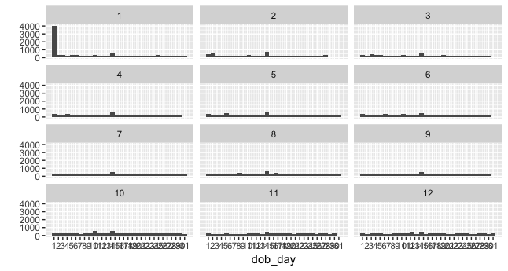
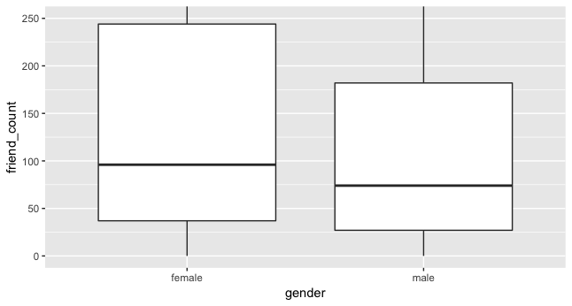
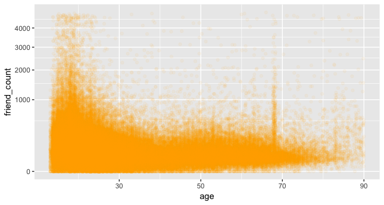

# Data Analysis with R

## R Basics

### Install R Studio on a Mac

- Download and install the R programming language **FIRST** at [http://cran.rstudio.com](http://cran.rstudio.com/).   
- After you install R, you can download and install RStudio from [http://www.rstudio.com](http://www.rstudio.com/). 

**I do not recommend installing R and RStudio using Homebrew or MacPorts**.

### R Studio Layout

- All four panels are configurable. The layout discussed is the default layout for RStudio. 
- You can change the default layout by going to Tools -> Options…


[Quick Guide to R Layout](http://dss.princeton.edu/training/RStudio101.pdf) by Oscar Torres-Reyna.

### Swirl

I recommend anyone new to R and RStudio to try [**Swirl**](https://swirlstats.com) (statistics with interactive R learning). Swirl is a software package for the R statistical programming language. Its purpose is to teach statistics and R commands interactively.

Type the following commands in the **Console**, pressing Enter or Return after each line:

```R
install.packages("swirl")
library(swirl)
swirl()
```

Note that the `>` symbol at the beginning of the line is R's prompt for you type something into the console. I include it here so you know that the above commands are to be typed into the console and not elsewhere. The part you type begins after `>`. 

#### Exit swirl

If you want to exit swirl, type the code below:

```r
bye()
```

Then leaving swirl now. Type `swirl()` to resume.

### Read and Subset Data

Read [this tutorial](http://flowingdata.com/2015/02/18/loading-data-and-basic-formatting-in-r/) on loading data into R by Nathan Yau.

[How to Subset Data](http://www.statmethods.net/management/subset.html)

#### Setting Workspace

```r
getwd() # print the current working directory - cwd 
ls()    # list the objects in the current workspace
```

```r
setwd(mydirectory)      # change to mydirectory
setwd("/usr/rob/mydir")
```

#### Read Data

```r
stateInfo <- read.csv('stateData.csv')
```

When I run this code above, I can see that `stateInfo` appears in my environment layout. I can double click on my data frame in the workspace, and this will let me see the table of values in RStudio. 


#### Subset Data

Here I'm passing the data frame, `stateInfo` to subset and I'm asking for it to retrieve any states that have a `state.region` equal to `1`. 

```r
subset(stateInfo, state.region==1)
```

When I run this code above, I can see the output down below.


Now, there is another way to subset this data frame.

It uses bracket notation, where I have the name of my dataset followed by two brackets.

```r
dataset[ROWS, COLUMNS]
```

The first spot is for the rows of my dataset that I want to keep, and the second spot is for the columns that I want to keep. So if I want only the states in the Northeast, I would write this code below.

```r
stateInfo[stateInfo$state.region==1, ]
```

The name of this dataset is `stateInfo` and then I want the rows that have a `state.region` equal to `1`. Now, I can't use just `state.region` here, I need to access the actual variable, so I have to put `stateInfo` and the `$` sign. This gives me the actual variable value, and I can see if it's equal to `1`. If it's equal to `1`, I want to return every single column in the data frame. So for example, with `Connecticut` if it's `state.region` is equal to one, I want to return every single column in this row. To return all the columns, I'll just leave this blank.


So this code searches for rows that have a `state.region` equal to `1`. And then it takes all the columns in that row. All of this will be sent to the console as a new data frame. Now it might not be so helpful to have this output just in the console. 


So I can save these subsets into new variables. I'm also going to include some functions to print out the first two rows of each data frame, and also their dimensions.


Now, I really want you to pay careful attention to the syntax in both of these examples. I tend to make use of the subset command, but there might be instances where I use this.

```r
stateSubset <- subset(stateInfo, state.region==1)

stateSubsetBracket <- stateInfo[stateInfo$state.region==1, ]
```

### R Markdown Documents

Markdown is a simple formatting syntax for authoring web pages (click the **Help** toolbar button for more details on using R Markdown).

When you click the **Knit HTML** button a web page will be generated that includes both content as well as the output of any embedded R code chunks within the document.

The file, [demystifyingR2.Rmd](https://github.com/jeongwhanchoi/Data-Analysis-with-R/blob/master/eda-course/lesson2/demystifyingR2.Rmd), is the example R Markdown with some codes. 
There is a difference between using the hash or pound symbol`#`inside and outside of a `{r}` block of code.

```
​```{r}
# The hash or pound symbol inside the r block creates
# a comment. These three lines of are not code and cannot be # executed.
x <- [1:10]
mean(x)
​```
```

If you use the `#` symbol outside of an `{r}` block of code, you can create headers of text. 

[Markdown Tutorial](https://www.youtube.com/watch?v=6A5EpqqDOdk): You can also use Markdown to format your posts in the discussions. 
I need to install and load the package `knitr` in order to use the **KNIT HTML** button . Run the following commands in the RStudio console to install and load knitr. 

```r
install.packages('knitr', dependencies = T)
library(knitr)
```

Here is the fantastic [R Markdown: The Definitive Guide](https://bookdown.org/yihui/rmarkdown/). 

### Factor Variables

- Read in the file. (Check your current working directory again everytime!)

```R
reddit <- read.csv('reddit.csv')
```

- Running the `str()` command, we can see that there's lots of data here.

```r
str(data)
```


```r
str(reddit)
```


Most of these variables have a type of factor. Now, a factor's a categorical variable that has different flavors or levels to it. An example of this would be emplyment status. This variable has many different levels such as employed full time, or employed part time, or not working. One thing we might be ineterest in is how many people are in each group of employment status. We can table that variable to see the number in each of these groups. 

```
$ employment.status: Factor w/ 6 levels "Employed full time",..: 1 1 2 2 1 1 1 4 1 2 ...
```

Running this code:

```R
table(reddit$employment.status)
```

 I can see the table like this below:


We can also get these counts and other data points  by running the summary function on our data frame. In addition to factor variables like employment status, the R programming language also has other data types like list and matices.

Learn more about [Data Types](https://www.statmethods.net/input/datatypes.html).

### Ordered Factors

Now, I want to draw your attention to the `age.range` variable right here.

```
$ age.range        : Factor w/ 7 levels "18-24","25-34",..: 2 2 1 2 2 2 2 1 3 2 ...
```

Notice that it says that we have a factor variable with seven different levels. We can examin the levels of a varible, by typing in the command levels and thewn putting it the variable right here.

```R
levels(reddit$age.range)
```

In the console we can see the seven levels of the `age.range` varible. 


Now, instead of creating a table of the `age.range` variable, let's create a plot that shows how many users are in each bin. That is, we want to figure out how many surveyed respondents are between the ages of 18 and 24,25 and 34, and so on. 

I'm going to create this plot using the `ggplot2 package`, and the qplot function that comes with it. 

> **Install ggplot2 package**
>
> To run the `qplot` function you must have the `ggplot2` library installed and loaded. You can do that by running these two lines of code.
>```r
>install.packages('ggplot2', >dependencies = T)
>library(ggplot2)
>```
>
>For those on Mac OS X 10.9 (or more recent OS X updates), the above line of code may display an error in the Console and fail to load ggplot2. This is due to a recent software update deleting the X11 symlink. You will need to *reinstall* XQuartz from <http://xquartz.macosforge.org/> and then run the following lines of code: 
>
>```r
>install.packages('devtools', >dependencies = T)
>library(devtools)
>install_version("colorspace","1.2-4")
>```

When I run this code,

```r
qplot(data = reddit, x = age.range)
```

 I get my plot over here. Zoooming in on this plot, I want you to notice that the age groups appear to be in order.


This is true for everyone except the survey takers who are under the age of 18. Now, it would be really hepful if this bagr was really oriented overe left side. That way we could make comparisons across the groups more easily. Now this is why we would want to have ordered factors. The variable `age.range` just contains factors with seven levels, but these levels aren't arranged in any particular order. Sometimes you want to introduce order into our dataset. So that way we can make more readable plots. 

### Setting Levels of Ordered Factors


If we try to see the amount of users in each age group, it's hard to compare immediately. This problem is even more noticeable on a different plot. If we try to create the same plot for users in each income bracket, we see a very similar problem.


And here it's much worse. These first two bins are for a 100,000 and over 150,000, and this last bin is for people who make under 20,000. Our eyes tend to read pages from left to right, so this graph is pretty hard to interpret. Or even better said, it's very hard to make comparisons naturally with our eyes. We have to always scan down to the bottom to figure out what group we're in. So let's order the factors in our age.range varibale.

#### Solution

[How to set and order factor levels](http://stats.idre.ucla.edu/r/modules/factor-variables/).

One way to do this is to use the `ordered()` funtion on the varible. We'll use the `ordered()` funtion on `age.range`,  and then we'll set the levels. I can run all this code below to set the levels, 

```r
reddit$age.range <- ordered(reddit$age.range, levels = c('under 18', '18-24', '25-34', '35-44', '45-54', '55-64', '65 of Above'))
```

and then, I can make my  plot again.


#### Alternate Solution

Another way to achieve the same result would be to use this code. Here, we're using the `factor()`. We're taking our `age.range` variable, setting the levels, and then making the order be ture since we want these ordered.

```r
reddit$age.range <- factor(reddit$age.range, levels = c('under 18', '18-24', '25-34', '35-44', '45-54', '55-64', '65 of Above'), ordered = T)
```


### Data Munging

It's important to note that many of the datasets that we've used so far are what I would call tidy datasets. What I mean is that these data sets were manipulated into a specified format of rows and columns. This is what allowed us to so easily important these datasets into R. You should know that not all datasets are going to be so nice. Sometimes, you may be pulling data from different sourves, like webpages, audio files, or even PDFs. Other times, you may need to reshape or rearrange your data into different formats.

The important thing to know is that this is a necessary step prior to conducting EDA and it's called data munching. There are plenty of tools for doing this kind of work, and if you're interested in learning more about how to wrangle and adjust data, check out the links below to.

> [Data Wrangling with MongoDB: Data Manipulation and Retrieval](https://www.udacity.com/course/ud032)
>
> Read this [fantastic tutorial](http://flowingdata.com/2015/02/18/loading-data-and-basic-formatting-in-r/) on loading data into R by Nathan Yau.
>
> [Tidy Data](http://vita.had.co.nz/papers/tidy-data.pdf) by Hadley Wickham
>
> [Tidy Data Presentation](http://courses.had.co.nz.s3-website-us-east-1.amazonaws.com/12-rice-bdsi/slides/07-tidy-data.pdf) by Hadley Wickham (June 2012)

---


## Explore One Variable

### Pseudo-Facebook User Data

I can use the `list.files()` command to figure out what that files are within this directory.

```r
list.files()
```
To read in the dataset I'm going to use the `read.csv()` command. But, I need to be a little bit careful. I need to indicate that the separator is really a tab, and that's because we're working with a tab separated values file. 

```r
pf <- read.csv('pseudo_facebook.tsv', sep ='\t')
```

Running the command, I can see that I get my data set up in R. Now this dataset is similar to the kind that data scientists see from time to time at Facebook, and it's especially the type of data that they'll use when doing EDA. 

This file has approximately 99,000 rows or observations in it with 15 variables. Each observation represents a user and that user wil have different information such as their age, their name or their date of birth.


We can see by running the names command.

```R
names(pf)
```

Now in this entire process our goal is to understand our user's behavior and their demographics. We're going to want to understand what they're doing on Facebook and what they use. This is why you see things like `friend_count`, `www_likes` and `mobile_likes`. 

.png)


> You could also use the following code to load the Pseudo Facebook data. 
> `read.delim('pseudo_facebook.tsv')` 
>
> The `read.delim()` function defaults to the tab character as the separator between values and the period as the decimal character. Run `?read.csv` or `?read.delim` in the console for more details.


### Histogram of Users' Birthdays

The first thing we need to do is download and install the `ggplot2` library.


> **If you did not install the `ggplot`, type the code below.**
>
> ```R
> install.packages('ggplot2')
> ```

Now that we have got the `ggplot2` loaded, let's use the `qplot()` function to plot a histogram showing the number of users whose birthdays fall on any given day. I can run their `name(pf)` command to get an output of all my variables. 

.png)

Now, I'm trying to create the date of birth by day histogram for all my users.  So I'm going to use the `dob_day`.

For the `qplot()` function, I'll pass it two parameters, `x`, and `data`.  `x` is going to take the variable of `dob_day`, and `data`'s going to take the variable `pf`, which is where all my data comes from, from the pseudo Facebook dataset. 

```r
qplot(x = dob_day, data = pf)
```

Running this command, I see my histogram come out in a plot window below. 


Now, you might notice that this plot is slightly different in color. If you're curious about setting color and themes in R, see this below.

> Run the following code in R to get other themes.
>
> ```
> install.packages('ggthemes', dependencies = TRUE)
> library(ggthemes)
> ```
>
> The ggthemes package was developed by Jeffery Arnold. Check out [examples](https://github.com/jrnold/ggthemes#examples) of the themes on the github page. 
> Chris is using `theme_minimal()`with the font size set to 24, which is why his output might look slightly different than yours. You can set the same theme in R by running the following code, or you can set the theme to a choice of your own. 
> `theme_set(theme_minimal(24))` 

Getting back our code in console, you can see that we get this warning message, when we run the code.


This is fine for now but, you should think about what this warning message means.

Let's fix the label on the x axis, so we can see everyday of the month here. So to adjust the x axis, I'm going to add a `+` sign right after my code and then hit **Return**.

```r
qplot(x = dob_day, data = pf) +
	scale_x_continuous(breaks=1:31)
```

This immediately takes me down the next line with a little bit of indentation right here. I'm going to add the layer scale x discrete and then give it the priority order breaks from 1 t0 31. This is because I want all my days to be 1 to 31, the days of the month. And running this code, we can see we've done a little bit better.


> Instead of using the `qplot()` function, you can also use the `ggplot()` function to create the histogram:
>
> ```
> ggplot(aes(x = dob_day), data = pf) +
>   geom_histogram(binwidth = 1) +
>   scale_x_continuous(breaks = 1:31)
> ```
>
> When you register at a websites, some sites have default setting that use the 1st day of the month under the birth day field. Some also use a default month of January.
>
> In the case of Facebook, Jan and the 1st are the first drop down items that appear on the site. It's important to think about such details and the data generating process when exploring data.

### Moira's Investigation

This paper below is whether people's perception of their audience on Facebook matches up to the reality. Who's actually seeing the content that they're sharing. Because who think is in your audience really affects how you present yourself. 

[Bernstein, M. S., Bakshy, E., Burke, M., & Karrer, B. (2013). Quantifying the invisible audience in social networks. In Proceedings of the SIGCHI Conference on Human Factors in Computing Systems (CHI 2013), pp. 21-30](http://hci.stanford.edu/publications/2013/invisibleaudience/invisibleaudience.pdf).

#### Perceived Audience Size

What she found, was that people dramatically underestimated the size of their audience. Typically, they guessed that their audience was about a quarter of the size that it actually was. When she first approached this problem, she plotted a bunch of histograms. She wanted to kwow how many people do people think are in their audience. So the first thing I did was, she know, she opened up R, and in `ggplot`, she plotted a histogra if people's guesses.

### Faceting

We can brek this histogram into twelve histograms, one for each month of the year. The code would look like this.

```r
qplot(x = dob_day, data = pf) + scale_x_continuous(breaks=1:31) +
facet_wrap(~dob_month, ncol = 3)
```

First, I'm going to add a layer and that layer is going to be called `facet_wrap()`.  `facet_wrap()` takes a formula where we have a tilde, and then we're going to use the variable that we're going to split our data over. In this case, `dob_month`. We have the number of columns set equal to three, and then we can run this code and see the ouput.



So notice, we took our one histogram and split it into 12 histograms. Since we set `ncol` are the number of columns equal to three, we can see the three columns in our one plot. Now, this one stands for January. This two would be for Februart, and so on. And if I wanted to I have used `ncol` equals four. It would have just given me a slightly different plot with four columns. Before we keep coding anymore, I want to focus on this `facet_wrap()`. Specifically, this formula right here. In general, `face_wrap()`  takes in a formula inside of its parenthesis. The formula contains a tilde sign followed by the name of the variable that you want to facet over. This allows you to create the same type of plot for each level of your categorical variable. In our case, we wanted to make histograms of `dob_day`, one for each month of the year. A similar layer to `facet_wrap()` is `facet_grid()`.

```R
facet_wrap(formula)
facet_wrap(~variable)
```

`facet_grid()` also takes a formula, but it's in a little bit different form. It's formula contains variables that we want to split over in the vertical direction, followed by a tilde sigh, and then the name of the variables we want to split in the horizontal direction. In general, where you place the variables can change how the graph is laid out, and the orientation of them. Now, facet grid is generally more useful to use when you're passing over two or more variables. If it's just one I would use `facet_wrap()`. 

```R
facet_grid(formula)
facet_grid(vertical ~ horizontal)
```

> It's best to create the plot in RStudio on your computer and examine at full screen. [Faceting](http://www.cookbook-r.com/Graphs/Facets_(ggplot2)/) in ggplot2
>
> Equivalent ggplot syntax:
>
> ```r
> ggplot(data = pf, aes(x = dob_day)) +
>   geom_histogram(binwidth = 1) +
>   scale_x_continuous(breaks = 1:31) +
>   facet_wrap(~dob_month)
> ```

### Friend Count

```R
qplot(x = friend_count, data = pf)
```

When I run the code, I can get my histogram. Looking at the plot, we can see that the data is squished on the left side of the graph, just like Moira's plot, and this graph extends all the way to the 5000 mark. This is what we call long tail data. This data can be common for some user-level data. Most users have friends counts under 500, so we get really tall bins on the left.


But there are a few users in our dataset with really high values. The higher values are closer to 5,000, which is the maximum number of friends a user can have.

> Create a histogram of friend_count using the `qplot()` syntax. We'll also accept the `ggplot()` syntax if you are familiar with it but additional parameters for setting the bin width or color won't be accepted. Keep it simple.
>
> You should create the histogram in R Studio on your computer first. Then, copy and paste your code into the {r} chunk.
>
> Remember to load the pseudo-facebook data set into a variable named `pf`. Otherwise, the grader will reject the answer. 
>
> Equivalent ggplot syntax for solution:
>
> ```r
> ggplot(aes(x = friend_count), data = pf) +
>   geom_histogram()
> ```

### Limiting the Axes

To avoid looking at all this long tail data, we can use the `xlim` parameter inside a `qplot()`. This parameter takes a vector where we have the start position and the ending position of our axes. In our case, we want to examine friend counts less than 1000. 

```r
qplot(x = friend_count, data = pf, xlim = c(0, 1000))
```

Running the code, I can see that I have my plot with friend counts less than 1000. Now there is another way to create the same plot.

```r
qplot(x = friend_count, data = pf) + scale_x_continous(limits = c(0,1000))
```

Here I won't use the `xlim` parameter. Instead I'm going to add a layer. I use limits instead of `xlim` as the parameter inside of here since I know this adjustment is already for the x axis. That's why its called `scale_x_continuos()`. There's also a counterpart for the y axis called scale y continuous. One of the neat concepts of `ggplot()` is that you can build up your plot in layers. We're going to discuss layers later, but for now I'm going to keep using the `qplot()` syntax.


### Adjusting the Bin Width

Looking at the histogram we created earlier, we can see that it's skewed. We've just zoomed in on the left sied of the graph from the histogram from before. Working from the new histogram, let's add some better labels and some binning. To adjust the binwidth, I can pass the `binwidth` parameter to QPLY. And for this data, I'm going to choose a value of 25. That seems pretty reasonable since we're going from zero to 1000. The other thing that I want to do is break up this x axis every saved 50 units. To do that, I'm going to pass the breaks parameter to our scale to x scale continous layer. 

```r
qplot(x = friend_count, data = pf, binwidth = 25) +
  scale_x_continuous(limits = c(0, 1000), breaks = seq(0, 1000, 50))
```

Breaks is going to take sequence that has a starting point, an ending point, and a step or the interval space we want on our axis. So in this case, I'm going from zero to a 1000, and I want to step every 50 units.


Let's take our histogram and split it up into two histograms for males and females. We do this by adding a facet wrap as another layer. This time, our `facet_wrap()` is going to take a formula where we have the tilde sign and then gender as our splitting variable, and when we run this code as you might find out, we get something quite unexpected. 

```r
qplot(x = friend_count, data = pf, binwidth = 25) +
  scale_x_continuous(limits = c(0, 1000), breaks = seq(0, 1000, 50)) + facet_wrap(~gender)
```

We don't just have two histograms, we have three. One for females, one for males, and one for NA.


> Equivalent ggplot syntax:
>
> ```r
> ggplot(aes(x = friend_count), data = pf) +
>   geom_histogram(binwidth = 25) +
>   scale_x_continuous(limits = c(0, 1000), breaks = seq(0, 1000, 50))
> ```
>
> In the alternate solution below, the period or dot in the *formula* for `facet_grid()` represents all of the other variables in the data set. Essentially, this notation splits up the data by gender and produces three histograms, each having their own row.
>
> ```r
> qplot(x = friend_count, data = pf) +
>   facet_grid(gender ~ .)
> ```
>
> Equivalent ggplot syntax:
>
> ```r
> ggplot(aes(x = friend_count), data = pf) +
>   geom_histogram() +
>   scale_x_continuous(limits = c(0, 1000), breaks = seq(0, 1000, 50)) +
>   facet_wrap(~gender)
> ```

### Omitting NA Observations

We have one for females, one for NA. [NA](https://www.statmethods.net/input/missingdata.html) stands for Not Applicable. And the third histogram we just created contains users who are not labeled as male or female.  This is how R handles missing values. Missing values take on a value of NA.

Let's try creating our histogram for friend counts split by gender one more time. But this time we'll take a subset of our data and ignore the obsvervations where the gender is NA. To do thatm=, I'm going to subset our data. I can use the `subset()` command, and use a condition for the second parameter. The first parameter is just the dataset.

```r
qplot(x = friend_count, data = subset(pf, !is.na(gender)), binwidth = 10) + scale_x_continuous(lim = c(0,1000), breaks = seq(0,1000,50)) + facet_wrap(~gender)
```


> Equivalent ggplot syntax:
>
> ```r
> ggplot(aes(x = friend_count), data = subset(pf, !is.na(gender))) +
>   geom_histogram() +
>   scale_x_continuous(limits = c(0, 1000), breaks = seq(0, 1000, 50)) +
>   facet_wrap(~gender)
> ```

### Statistics `by()` Gender

It might be hard to determine which gender has more friends on average. 

Instead of looking at these histograms, we can use the table command to see if there are more men versus women. 

```r
table(pf$gender)
```

When I run that command, I get this output.

| female | male  |
| :----: | :---: |
| 40254  | 58574 |

So, it liiks like there's slightly more males than females in our sample. To look at the average `friend_count` by `gender`, we'll need another new command. This command is the `by()` command. The `by()` command takes three inputs: a variable, a categorical variable, or a list of indices to subset over, and a function. In our case, we want to use the Summary as the funtion to get basic statistics on our `friend_count`. So, `friend_count`'s the variable, `gender` is our categorical variable, or the variable that contains our segments of users.

```R
by(pf$friend_count, pf$gender, summary)
```

And we want a summary of the `friend_count` by `gender`.

- pf$gender: female

| Min. | 1st Qu. | Median | Mean | 3rd Qu. | Max. |
| :--: | :-----: | :----: | :--: | :-----: | :--: |
|  0   |   37    |   96   | 242  |   244   | 4923 |

- pf$gender: male

| Min. | 1st Qu. | Median | Mean | 3rd Qu. | Max. |
| :--: | :-----: | :----: | :--: | :-----: | :--: |
|  0   |   27    |   74   | 165  |   182   | 4917 |

#### Who has more friends, males or females?

- Which gender on average has more friends?
  - female
- What's the difference between the median friend count for women and men?
  - 22
- Why would the median be a better measure than the mean?
  - The median is a better measure than mean because it's a more robust statistic. A few people with huge friend counts drag the mean upwards which isn't necessarily representative of most users. What's nice is that the median's resistant to change, since it marks the halfway point for all data points. So as long as we trust half of our values, we can report a reliable location of the center of our distribution.

### Tenure

I am going to examine the distribution of tenure, or how many days someone has been using Facebook. I'm also going to start introducing color to jazz up our plots a little bit. To do that I'm going to use the color and the fill parameter. 

```r
qplot(x = tenure, data = pf, color = I('black'), fill = I('#099DD9'))
```

If this code has thrown you for a loop, I don't want you to focus on it too much, you can really just ignore it. I'll typically include it as the second line of parameters inside of qplot. Running this code, you can see we get a nice histogram.


And again, here the histogram has defaulted to the automatic bin width. I'm going to make one last adjustment and set it for ourselves. By setting the `binwidth` equal to 30, we can see we get a finer view of the distribution. 

```r
qplot(x = tenure, data = pf, binwidth=30, color = I('black'), fill = I('#099DD9'))
```

Let's see if you have a handle on histograms and bin width.


You need to alter the variable tenure, so that way, it was measured in years instead of days. And this should make a lot of sense, since 365 days would be one year, and 730 days would be two years. Now for the binwidth, let's set it equal to one so we get  a count for yearly users. 

```r
qplot(x = tenure/365, data = pf, binwidth=.25, color = I('black'), fill = I('#F79420'))
```

Running this code, we can see our histogram. And notice here that we have a different color.


 I did by changing the hex code. To get a finer view of our data, we could set the bandwidth equal to 0.25. It   looks like the bulk of our users had had less than two and a half years on Facebook. To improve this plot in one more way, I can change the x axis, so that way it increments by one year. 

```r
qplot(x = tenure/365, data = pf, binwidth=.25, color = I('black'), fill = I('#F79420')) + scale_x_continuous(breaks = seq(1,7,1), limits = c(0,7))
```

To do that, I can add the layer of `scale_x_continuous()` and set the `breaks` from one to seven. I'm also going to limit our data so that we only see users from zero to seven years. Writing this code, we can see we have a very nice histogram.


> The parameter `color` determines the color **outline** of objects in a plot.
>
> The parameter `fill` determines the color of the **area** inside objects in a plot.
>
> You might notice how the color `black` and the [hex code](http://en.wikipedia.org/wiki/Web_colors) color of `#099DD9` (a shade of blue) are wrapped inside of `I()`. The `I()` functions stand for 'as is' and tells `qplot` to use them as colors.
>
> Learn more about what you can adjust in a plot by reading the [ggplot theme documentation](http://docs.ggplot2.org/0.9.2.1/theme.html)
>
> Equivalent ggplot syntax for plots:
>
> ```r
> ggplot(aes(x = tenure), data = pf) +
>   geom_histogram(binwidth = 30, color = 'black', fill = '#099DD9')
> 
> ggplot(aes(x = tenure/365), data = pf) +
>   geom_histogram(binwidth = .25, color = 'black', fill = '#F79420')
> ```

### Labeling Plots

```
qplot(x = tenure/365, data = pf, xlab = 'Number of years using Facebook', ylab = 'Number of users in sample', binwidth=.25, color = I('black'), fill = I('#F79420')) + scale_x_continuous(breaks = seq(1,7,1), limits = c(0,7))
```

We can use the `xlab` and `ylab` parameters. Now, making sure I have a comma after each of these new parameters, I can run this code and see the labels on their plot.


> Equivalent ggplot syntax:
>
> ```r
> ggplot(aes(x = tenure / 365), data = pf) +
>   geom_histogram(color = 'black', fill = '#F79420') +
>   scale_x_continuous(breaks = seq(1, 7, 1), limits = c(0, 7)) +
>   xlab('Number of years using Facebook') +
>   ylab('Number of users in sample')
> ```

### User ages

To create our histogram of user ages, let's start by using the `qplot()` function. We'll pass it the variable age. And our dataset is pseudo Facebook so `pf`. I'm going to add some color using the color and fill parameters.

```r
qplot(x = age, data = pf, color = I('black'), fill = I('#5760AB'))
```

Running this code we see we get our histogram.


Now you might have tried a variety of bin widths. And in this case I think a bin width of one is the best. So let's add that in here. I chose a `binwidth` of one since, one makes sense, since we're going by years or ages. 

```r
qplot(x = age, data = pf, binwidth = 1, color = I('black'), fill = I('#5760AB'))
```

This gives me a histogram of counts of users by individual years, so I can get a finer view of the data for say, like, 25years old.


By setting the `binwidth` equal to one, it allows us to more easily spot unusual spikes in our data.

I see the lsrgest spikes in the mid to late 20's, and we don't have any users who put in an age lower than 13 at the left of the histogram. This makes sense because users must be at least 13 years old to set up Facebook account. Now there's also some unusual spikes above 100, but my guess is that some users may be exaggerating their age. 

```R
qplot(x = age, data = pf, binwidth = 1, color = I('black'), fill = I('#5760AB')) + scale_x_discrete(breaks = seq(0, 113, 5))
```

We can use scale x discrete or scale x continuous to change this appearance. So I adding scale x discrete here, I can set the breaks so they run from 0 to 113, and they increment every five units, or every five years. Now you might be wondering why I chose 113 here, and I just used the maximum age in our user dataset.


> **Note**: The use of the `scale_x_discrete()` layer as shown in the video is depreciated as of `ggplot2`version 2.0. You can use `scale_x_continuous()` instead to get the break points, or use `ggplot()`syntax as shown below.
>
> Equivalent ggplot syntax:
>
> ```r
> ggplot(aes(x = age), data = pf) +
>   geom_histogram(binwidth = 1, fill = '#5760AB') +
>   scale_x_continuous(breaks = seq(0, 113, 5))
> ```

### Transforming Data

Let's use the approach of transforming variables on our Facebook dataset. Most of our varibles, such as friend count, likes, comments, wall posts and others are variables that I would call engagement variables, and they all have very long tails. 

```r
qplot(x = friend_count, data = pf)
```

Some users have 10 times, or even 100, the median value. Another way to say this is that some people have an order of magnitudes, more likes, clicks, or comments, than any other users. In statistics, we say that the data is over dispersed. Often it helps to transform these values so we can see standard deviations, or orders of magnitudes, so we are in effect, shortening the tail. 


Here was our histogram of friend count from before, and notice, we still have that long tail. We can transfrom this variable by taking the log, either using the natural log, log base 2, or log base 10. We could also use other functins, such as the square root, and doing so helps us to see patterns more clearly, without being distracted by the tails. A lot of common statistical techniques, like linear regression, are based on the assumption that variables have normal distributions. So by taking the log of this variable, we can transform our data to turn it into maybe a normal distribution or something that more closely resembles a normal distribution, if we'd be using linear regression or some other modelling technique.

Now, I kwow we're not doing modelling here, but let's just see what it looks like to transform the variable. First, I'm going to just do this in the `summary()` command. 

```R
summary(pf$friend_count)
```

So here's our regular summary of `friend_count`. Looks like the median `friend_count` is 82, and the meam is 196.

| Min. | 1st Qu. | Median | Mean  | 3rd Qu. |  Max.  |
| :--: | :-----: | :----: | :---: | :-----: | :----: |
| 0.0  |  31.0   |  82.0  | 196.4 |  206.0  | 4923.0 |

I can take the log base 10 of this `friend_count` and get a different table. Now this seems a little bbit unusual since I have negative infinity for the minimum and negative infinity for the mean.

```r
summary(log10(pf$friend_count))
```

Some of our users have a friend count of zeor. So, when we take the log of base 10 of zero, that would be undefined. For those familiar with Calculus, the limit would be negative infinity, which is why that appears here. 

| Min. | 1st Qu. | Median | Mean | 3rd Qu. | Max.  |
| :--: | :-----: | :----: | :--: | :-----: | :---: |
| -Inf |  1.491  | 1.914  | -Inf |  2.314  | 3.692 |

To avoid this, we're going to add one to  `friend_count`, so that way we don't get an undefined answer, or negative infinity.

```r
summary(log10(pf$friend_count + 1))
```

There, that looks much better.

| Min. | 1st Qu. | Median | Mean  | 3rd Qu. | Max.  |
| :--: | :-----: | :----: | :---: | :-----: | :---: |
|  0   |  1.505  | 1.919  | 1.868 |  2.316  | 3.692 |

 And, just to show you another function, let's also use the square root on friend count.

```r
summary(sqrt(pf$friend_count))
```

This would be another type of transformation.

| Min. | 1st Qu. | Median |  Mean  | 3rd Qu. |  Max.  |
| :--: | :-----: | :----: | :----: | :-----: | :----: |
| 0.0  |  5.568  | 9.055  | 11.088 | 14.353  | 79.164 |

For me, log base 10 is an easier transformation to wrap my head around, since I'm just comparing friend counts on orders of magnitude of 10. Basically a tenfold scale like th pH scale. Now that you've seen transformations within summaries, let's see if you can apply a similar transformation to the histogram.

- [Create Multiple Plots in One Image Output](http://lightonphiri.org/blog/ggplot2-multiple-plots-in-one-graph-using-gridextra)

- [Add Log or Sqrt Scales to an Axis](http://docs.ggplot2.org/current/scale_continuous.html)
- [Assumptions of Linear Regression](http://en.wikipedia.org/wiki/Linear_regression#Assumptions)[Normal Distribution](http://en.wikipedia.org/wiki/Normal_distribution)

Let's create three histograms on one output plot. And to do that you needed to install the grid extra package and load it into R Studio. 

```r
install.packages('gridExtra')
library(gridExtra)
```

Once you've got that, now it's just a matter of creating each of the three histograms. And saving them to three variables. I'll use p1, p2 and p3 for each of the plots that I'm going to create. 

```r
p1 <- qplot(x = friend_count, data = pf)
p2 <- qplot(x = log10(friend_count + 1), data = pf)
p3 <- qplot(x = sqrt(friend_count), data = pf)
```

Now the first histogram is the same as before. We just have `friend_count`, pass to `x`, and `pf`, pass to `data`. For the second histogram, we'll take the log10 of `friend_count`. And remember to add 1 to it first, so that we don't get any undefined results. And finally for our third histogram, we'll simply take the square root of `friend_count`. Now, if I run all these lines of code, I can see that I create three new variables that  saves each of my plots. And now I just need to pass each of these plots to grid dot arrange. 

```R
grid.arrange(p1, p2, p3, ncol = 1)
```

And set `ncol` equal to 1, since I just want one column with all my histograms. And running my code, I can see that I get all three histograms. And here's a closer view of the three. Notice that our second plot is much better. Since we have a normalish kind of distribution. The square root transform is also better than no transformation at all, since we don't have as much of a long tail.


We do still have a long tail, it's just that much lower friend count since we transformed the variable. The tilt's just not as bad as before. Now there was another way to create these same three histograms using a different type of syntax. Now ths syntax is a little more complicated at first. 

This time, we're going to use the `ggplot` syntax to create our histogram. `ggplot` is very similar to the `qplot()`, since it still takes the same parameters, x and data. 

```r
p1 <- ggplot(aes(x = friend_count), data = pf) + geom_histogram()
```

The key differnece is that we need to include any x or y variables inside this aesthetic wrapper or AES. The other thing we need to do is we need to tell `ggplot()` what type of plot we want to create. Or what kind of geom we want. The geom that we want is geom histogram. Running this bit of code I can see that I get my original hitogram. Which is the first one we created on `friend_count`. RUnning the entire line I can save this hitogram into `p1`. Now I've got a plot that I can just alter using scales. So for the second plot, I'm going to take my first plot and just add a `scale_x_log10` to it. This is going to transform the x-axis, or the x variable, using log base 10. Similarly, for the third graph, I'm going to add scale x square root. Now, I don't want to use `p2` here, since I've already got a scale log 10 on it. I want to use my original graph, `p1`. And add scale x square root.

```r
p2 <- p1 + scale_x_log10()
p3 <- p1 + scale_x_sqrt()
```

Now saving all these plots and writing our `grid.arrange()` function, we get the same output as we had before.

```r
grid.arrange(p1, p2, p3, ncol = 1)
```

Now there is a slight difference here based on the x-axis labelling.


### Add a Scaling Layer

```r
logScale <- qplot(x = log10(friend_count), data = pf)

countScale <- ggplot(aes(x = friend_count), data = pf) + geom_histogram() + scale_x_log10()
```

Let's look at the differences between these two plots and see what the two adjustments really do. I'm going to save this first plot into `logScale` and I'm going to save the second plot into `countScale`. I'm going to use each of these variables and pass it to `grid.arrange`, so that way I can plot them side by side, and that's why the `ncal` is equal to two. 

```r
grid.arrange(logScale, countScale, ncol = 2)
```

Running this code, we can see that we get our two histograms.


When looking at the two plots, we can see that the difference is really in the x axis labeling. Using `scale_x_log10` will label the axis in actual `friend_counts`. Whereas using the log10 wrapper will label the x axis in log units. This is just something to keep in mind as you make more plots. In general, I think it's easier to think about actual counts, so that's why I prefer using the `scale_x_log10` as a layer.

> Equivalent ggplot code:
>
> ```r
> ggplot(aes(x = friend_count), data = pf) + 
>   geom_histogram() +
>   scale_x_log10()
> ```

### Frequency Polygons

So far we've seen how to examine a variables distribution using histograms, and how to check our hunches with visualizations and numerical summaries. But there's another type of plot that lets us compare distributions, and it's called the frequency polygon. Frequency polygons are similar to histograms, but they draw a curve connecting the counts in a histogram. So this allows us to see the shape and the peaks of our distribution in more detail. You might remember from before that we were looking at `friend_count` using this code. 

```r
qplot(x = friend_count, data = subset(pf, !is.na(gender)), binwidth = 10) + scale_x_continuous(lim = c(0,1000), breaks = seq(0, 1000, 50)) + facet_wrap(~gender)
```

This code gives a histogram of our user's `friend_counts`, and then we added a `facet_wrap()` and broke it out by gender. Remember we were trying to answer the question, who on average has more friends, men or women. 


We said we couldn't tell based on this histogram, so we ran some numerical summaries instead. And instead of having these 2 histograms side by side, we can actually use a frequency polygon and overlay these histograms together. Here's how we can create that frequency polygon. I'll copy and paste the same code, except I need to make an addition. 

```r
qplot(x = friend_count, data = subset(pf, !is.na(gender)), binwidth = 10, geom = 'freqpoly', color = gender) + scale_x_continuous(lim = c(0,1000), breaks = seq(0, 1000, 50))
```

By default q plot's going to create a histogram when I pass it just one single variable. So I need to tell it to create a frequency polygon instead. I can use the geom parameter to do that. Here, I'll pass it frequency polygon, so that way we create a different type of plot, and I won't need this facet wrap by gender anymore. To get the distributions of each gender on the plot, I'm going to pass the parameter color to q plot and set it equal to gender. So here's my color parameter, and now I'm going to pass it gender. When I run this code, I get one plot with 2 frequency polygons one for males and one for females.


 And notice how gender has been assigned a color, so color is indicating which frequency polygon I'm on. And this is what the frequency polygon is really good for. We can compare 2 or more distributions at once, but again, this plot doesn't really answer our question who has more friends on average men or women. Let's change the y-axis to show proportions instead of raw counts. This is going to involve some funky syntax, so I want to explain it. To change this count variable, we're going to pass in y to our `qplot()` function. I'm going to assign the parameter `y` this expression. 

```r
qplot(x = friend_count, y = ..count../sum(..count..) ,data = subset(pf, !is.na(gender)), xlab = 'Friend Count', ylab = 'Propportion of Users with that friend count', binwidth = 10, geom = 'freqpoly', color = gender) + scale_x_continuous(lim = c(0,1000), breaks = seq(0, 1000, 50))
```

This allows me to get proportions instead of the actual raw counts on the y-axis. And I'm just move this around so that way my code looks a little bit cleaner. And finally, let me change the labels to more accurately explain the plot. Alright, it looks like I have everything. Let's run this code and see the differences.


 Zooming in on the plot, we can see that we've changed the y-axis scale, and we have our labels appearing. And while it may appear that males have higher friend counts on average than women, we can see that many males or a high percentage of them have low friend counts. It's probably in this tail region of the graph where females overtake males. 

Remember, our goal in analyzing this Facebook user data is to understand our users and their behavior. In this case, we're wondering whether or not males or females end up using likes on the World Wide Web more often. So, first I'm just going to remind myself of what variables are in my data set. I'm wanting to compare likes between the genders, so I'm going to use `www_likes`. 

```r
qplot(x = www_likes, data = subset(pf, !is.na(gender)), geom = 'freqpoly')
```

This code would give me a histogram which isn't what I want. And remember I also need to subset my data to remove any values for gender that are in a. Now this bit of code is starting to look more like what I want. But, I've only got one frequency polygon on here, and I need two. 


So I'm going to use the color parameter, and pass a gender.

```r
qplot(x = www_likes, data = subset(pf, !is.na(gender)), geom = 'freqpoly', color = gender)
```

That seems a little bit better.


I'm also going to add `scale_x_continuous()`, since I know that World Wide Web likes is on a continuous scale. Alright, now we're looking at a reasonable plot. Zooming in, it looks like males typically have more likes on the web. But I can't really make sense of the tail end of this graph. This is long tail data, so let's use a log transformation to see if we can get a better look at what's happening down here.

```r
qplot(x = www_likes, data = subset(pf, !is.na(gender)), geom = 'freqpoly', color = gender) + scale_x_continuous() + scale_x_log10()
```

 I'm going to go back to my code and add a `scale_x_log_10`. Running this code we get a different plot with much more information. 


It looks like males have more likes on the web at first, but we can see that females overtake males at this point in the graph.

### Likes on the Web

The `by()` command is going to allow us to answer those question. 

> - What's the `www_likes` count for males?
> - Which gender has more `www_likes`?

So first I'm going to create an r block of code and I'm going to use the by command. I'll pass a `www_likes` as the first parameter and then I'll pass gender as the second, since that's the variable I would have split our `www_likes` over. I want to total of likes for each gender, so I'm going to use the sum function here. 

```r
by(pf$www_likes, pf$gender, sum)
```

Writing this code we can see our output. The likes for males is at 1430175. But it's the females that have way more likes. There are over three and a half million.

| female  |  male   |
| :-----: | :-----: |
| 3507665 | 1430175 |

It looks like females have more than two times the number of likes as men. And while this might seem trivial, information like this can help websites or other businesses decide which features are used most often by different subgroups. This might help a business or a website decide which feature they should continue to invest in, or which ones they should just leave behind.

### Box Plots

Let's use another type of visualization that's helpful for seeing the distribution of a variable called a box plot. You may recall earlier that we split friend count by gender in a pair of histograms using `facet_wrap()`. The code looked like this. 

```r
qplot(x = friend_count, data = subset(pf, !is.na(gender)), binwidth = 25) + scale_x_continuous(lim = c(0,1000), breaks = seq(0, 1000, 50)) + facet_wrap(~gender)
```

Instead of using these histograms we're going to generate box plots of `friend_count` by `gender`, so we can quickly see the differences between the distributions. And in particular we're going to see the difference between the median of the two groups. And remember again the the `qplot()` function automatically generates histograms when we pass it a single variable. So we need to add a parameter to tell `qplot()` that we want a different type of plot. To do that, we're going to use the `geom` called box plot. 

```r
qplot(x = gender, y = friend_count, data = subset(pf, !is.na(gender)), geom = 'boxplot')
```

Now, I'm going to use the same data set as before. So I'm going to keep this and `qplot()`. Now, what's different about box plots is that the y axis is going to be our friend count. The x axis, on the other hand, is going to be our categorical variables for male and female, or gender. Notice that we use the continuous variables. `friend_count` as `y`. And the grouping, or the categorical variable as `x`. This will always be true for your box plots. I forgot a parenthesis here and then let me just reformat my code so it looks a little bit cleaner. There we go.  Running this code, we can see that we get our two box plots. Let's zoom in to get a closer look. 


The boxes here and here cover the middle 50% of values, or what's called the inner quartile range. And I know these boxes are hard to see, since we have so many outliers on this plot. Each of these tiny little dots is an outlier in our data. We can also see that the y axis is capturing all the friend counts from zero all the way up to 5,000. So we're not omitting any user data in this plot. And finally, this horizontal line, which you may have noticed at first, is the median for the two box plots. And you might be wondering what makes an outlier an actual outlier. And well, we usually consider outliers to be just outside of, one and a half times the IQR from the media. Since there's so many outliers in these plots, let's adjust our code to focus on just these two boxes.

```r
qplot(x = gender, y = friend_count, data = subset(pf, !is.na(gender)), geom = 'boxplot', ylim = c(0,1000))
```

To change what our box plots look like, we just need to adjust the Y axis. We can use the `ylim` parameter inside of `qplot()`  to do so. Here, I can set the upper and lower limits. The lower limit will be 0 and the upper limit will be 1000. Now, you may or may not have gotten a warning message here about removing data points. When we use the `ylim` parameter, we're actually removing data points from our calculations. So the original box plots that we have might look slightly different from this. Another way to create the same plot is to use the `scale_y_continuous()` layer. So we can use this same bit of code here and then just close off our parenthesis. Adding the `scale_y_continuous()` layer, I can set the limits to be between 0 and 1000. 

```r
qplot(x = gender, y = friend_count, data = subset(pf, !is.na(gender)), geom = 'boxplot') + scale_y_continuous(limits = c(0, 1000))
```

Running this code, we can see that we get the same exact box plots. 


What I want to draw your attention to, is the female box plot. Notice how the top of the box is just below 250. So this value might be around 200 or 230. But this value might not be accurate for all of our data. When we use the `ylim` paramater or the `scale_y_continuous()` layer, we actually remove data points from calculations. So a better way to do this is to use the `coord_cartesian()` layer to set the y limits instead. So, we'll use the same bit of code and then instead of adding `scale_y_continuous()` layer, we'll add the `coord_cartesian()` layer.

```R
qplot(x = gender, y = friend_count, data = subset(pf, !is.na(gender)), geom = 'boxplot') + coord_cartesian(ylim = c(0,1000))
```

And here I'll set the y limits from 0 to a 1000. Notice how the top of the box has moved slightly closer to 250 for females. 


What the bottom of the box means. And what this black line means.

> [How to read and use a Boxplot](http://flowingdata.com/2008/02/15/how-to-read-and-use-a-box-and-whisker-plot/)
>
> The [interquartile range or IQR](http://en.wikipedia.org/wiki/Interquartile_range) includes all of the values between the bottom and top of the boxes in the boxplot.
>
> [Visualization](http://en.wikipedia.org/wiki/File:Boxplot_vs_PDF.svg) of the IQR with a normal probability distribution function with μ=1μ=1 and σ2=1σ2=1 (pdf).
>
> [Intro to Descriptive Statistics Exercise: Match Box Plots](https://classroom.udacity.com/courses/ud827/lessons/1471748603/concepts/834179180923)

### Box Plots, Quartiles and Friendships


It looks like females on average have slightly more friends than men. Since I can see that this median line is slightly higher. That's what this black line is. It represents the median or the middle 50% of friend counts for females and for males. 

```r
qplot(x = gender, y = friend_count, data = subset(pf, !is.na(gender)), geom = 'boxplot') + coord_cartesian(ylim = c(0,250))
```

Now this difference isn't very large. So let's zoom in to take a closer look. 



This box for females and this box for males Represents the middle 50% of values in our sample. So, I think it makes sense that we zoom in even more to take a closer look. We should consider any values less than 250. Now, there's no exact choice here, I'm just choosing something that seems reasonable, since the bulk of my data is down here. After running this code, we can now see that the bulk of user friend count is similar for the middle 50% of men as it is for the middle 50% of women. Its just our females are slightly higher for friend count. Lets look at actual values though and compare the values to what we see in our box plot. We can look at those values by using the by command and running a summary of our friend count split by gender. So first, I want to include my friend count which is the variable I want a summary of. I want to split it over gender and I want a summary.

```r
by(pf$friend_count, pf$gender, summary)
```

Running this code, I get an output of my table, which shows me the minimum maximum values for both genders, as well as the quartiles.

- female

| Min. | 1st Qu. | Median | Mean | 3rd Qu. | Max. |
| :--: | :-----: | :----: | :--: | :-----: | :--: |
|  0   |   37    |   96   | 242  |   244   | 4923 |

- male

| Min. | 1st Qu. | Median | Mean | 3rd Qu. | Max. |
| :--: | :-----: | :----: | :--: | :-----: | :--: |
|  0   |   27    |   74   | 165  |   182   | 4917 |

The first quartile for women is 37 and that looks about right in our graph. The third quartile or the 75% mark is at 244. This means that 75% of female users have friend counts below 244. Or another way to say this is that 25% of female users have more than 244 friends. Similarly for the men, we can see how the first quartiles and the third quartiles match up to the box plot. Now, you might have remembered that we used `coord_cartesian()`. We did this so that way, the table output would match our box plots. If we would have just used the `ylim` parameter inside of qplot, we would have gotten different quantiles that wouldn't match our picture. This is just a subtle difference that you should be aware of when working in R. 

To make my box plot I'll pass `x` the variable gender, since that's my categorical variable. And then I'll pass `y`, `friendships_initiated`. Now I need to subset my data frame just like from before.

```r
qplot(x = gender, y = friendships_initiated, data = subset(pf, !is.na(gender)), geom = 'boxplot') + coord_cartesian(ylim = c(0,500))
```

And then I'll need to tell cube plot that I want to box plot. So I'll set the `geom`.


Looking at this plot, we see that most users make less than 500 friend requests. So let's set our y limb setting zero as our minimum and 500 as our max. So I'll add the `cored_cartesian()` layer and set my limits. It's really close, but it looks like females have slightly more friend requests. Since the median black line is slightly higher for females than this median black line for males. Now, this might be too close to call. So, I say we should zoom in again. 

```r
qplot(x = gender, y = friendships_initiated, data = subset(pf, !is.na(gender)), geom = 'boxplot') + coord_cartesian(ylim = c(0,150))
```

This time, we'll change the upper limit to 150. 


Yeah, it looks like females initiate slightly more friendships on average. Let's also check this with a numerical summary. I can use the by command and split `friendships_initiated` by gender and then, find their summary. 

```R
by(pf$friendships_initiated, pf$gender, summary)
```

So, I'll take my `friendships_initiated`, split it by `gender` and then run a `summary`. And here's our output. 


And we can see that the median for females is 49 whereas the median for males is 44. Now, you might be wondering, why should we even create this box spot to begin with if we can answer our question with a numerical summary. Well, it's helpful to understand the distribution of the data. So in the case of the box plot, we can see the middle 50% of values for each segment of our categorical variable. Our box plots also let us get a sense of alliers. So in one way, they're much more rich with information than just this table.

> [How to Interpret a Boxplot](http://flowingdata.com/2008/02/15/how-to-read-and-use-a-box-and-whisker-plot/)   The [interquartile range or IQR](http://en.wikipedia.org/wiki/Interquartile_range) includes all of the values between the bottom and top of the boxes in the boxplot. 

### Getting Logical

So far, we've looked at a number of visualizations to examine the distribution of a single variable. And, we also looked at transforming a variable to get a better look at the data. Now, there are other ways that we can transform a variable, beside using something like the square root or a log. You often want to convert variables that have a lot of zero values to a new binary variable that has only true or false. This is helpful because we may want to know whether a user has used a certain feature at all, instead of the number of times that the user has actually used that feature. For example, it may not matter how many times a person checked in using a mobile device. But, whether the person has ever used mobile check-in. Here's what I mean. 

```r
summary(pf$mobile_likes)
```

Here's a summary of the mobile likes in our dataset. 

| Min. | 1st Qu. | Median | Mean  | 3rd Qu. |  Max.   |
| :--: | :-----: | :----: | :---: | :-----: | :-----: |
| 0.0  |   0.0   |  4.0   | 106.1 |  46.0   | 25111.0 |

The median is four, which means we have a lot of zeroes in our dataset. If I run this summary, I'm going to get a different type of table. Notice that in the table I get logical counts, because I use this comparison operator. 

```r
summary(pf$mobile_likes > 0)
```

|  Mode   | FALSE | TRUE  |
| :-----: | :---: | :---: |
| logical | 35056 | 63947 |

I wanted to see whether or not someone had actually checked in. So, instead of tracking the count of mobile likes, let's create a new variable that tracks mobile check-ins. We'll call this variable, mobile_check_in. The first thing I'll do is assign it a bunch of NA values. Next, we can use the if/else function to assign a value of one if the user has checked in using mobile and a value of zero if the user has not checked in. So in this if/else statement, if this condition is true, we'll assign our user a value of 1. Otherwise, we'll give them a value of 0. And the last thing I'll do is convert it to a factor variable. Running this code, I get my new variable saved. And then taking a summary of the results, I can see that about 64,000 just shy of that, have checked in using mobile while 35,000 have not.

```r
mobile_check_in <- NA
pf$mobile_check_in <- ifelse(pf$mobile_likes > 0, 1, 0)
pf$mobile_check_in <- ifelse(pf$mobile_likes)
summary(pf$mobile_check_in)
```

|  Min.  | 1st Qu. | Median |  Mean  | 3rd Qu. |  Max.  |
| :----: | :-----: | :----: | :----: | :-----: | :----: |
| 0.0000 | 0.0000  | 1.0000 | 0.6459 | 1.0000  | 1.0000 |

We need to know the number of users who did check in using mobile and the total number of users in our sample. Now I could have just used these two numbers and divided them, but I want to do this programmatically. 

```r
summary(pf$mobile_check_in)
sum(pf$mobile_check_in == 1)/length(pf$mobile_check_in)
```

To do that I can take the sum of my mobile check in variables when it's equal to one. And then divide that by the length of that vector. This is how many users are in our sample. Running that code I can see that I get about 64.5%, or 64.6%. Rounding to the nearest percent, that's just 65. Now that's over half of the users in the data set, so it wouldn't make a whole lot of sense to continue the development of the mobile experience. At least based on this sample data set.

- output: 0.6459097

---

## Explore Two Variables

### Scatterplots

Now we're going to look at two continuous variables at the same time. So, to get started, make sure you're in the right working directory, and then go ahead and load your data set and load the ggplot library. Usually it's best to use a scatter plot to examine the relationship between two continuous variables. `qplot()` chooses the scatter plot automatically when we pass two continuous variables to the `x` and `y` parameters, so let's go ahead and do that. I'll pass h to the `x` parameter, and I'll pass friend count to the `y` parameter, and finally I'll indicate that my data set is `pf`, my pseudo Facebook users. 

```r
library(ggplot2)

pf <- read.csv('pseudo_facebook.tsv', sep = '\t')
qplot(x = age, y = friend_count, data = pf)
qplot(age, friend_coint, data = pf)
```

Now, there's over 99,000 observations in our data, so when we create this plot, it might take a few moments to render. And there it is. We could also write this code which will produce the same exact plot. This time, I'm not using the `x` and `y` parameters explicitly. And that's okay, because `qplot()` knows which variables to use on which axis. `x` will come first, and `y` will come second. I'll run this code, just so that way you can see the same plot being produced.


Here are some of the things that I noticed. It looks like younger users have a lot of friends. These young users seem to have thousands of more friends than most users over the age of 30. You also might have noticed that there are some vertical bars where people have lied about their age, like 69 and also about 100. Those users are also likely to be teenagers, or perhaps fake accounts, given these really high friend counts.

> You can also read in the data using the following code:
>
> ```r
> read.delim('pseudo_facebook.tsv')
> ```
>
> The equivalent ggplot syntax for the scatterplot:
>
> ```r
> ggplot(aes(x = age, y = friend_count), data = pf) +
>   geom_point()
> ```

### ggplot Syntax

Let's make some improvements to our scatter plot. This time we're going to start by switching from the `qplot` syntax to the more formal and verbose `ggplot` syntax. The `ggplot` syntax will let us specify more complicated plots. So just as a reminder, this is the `qplot` syntax in order to create the scatter plot. 

```r
qplot(x = age, y = friend_count, data = pf)
```

`ggplot` is another plotting function similar to `qplot`, and it has slightly different syntax. Here's the equivalent code to produce this scatter plot. 

```r
ggplot(aes(x = age, y = friend_count), data = pf) + geom_point()
```

The main difference between `qplot` and `ggplot` is that we have to say what type of geom or chart type that we want. In this case, we want a scatter plot. So we're going to use the `geom_point`. You can see the full list of chart types in the ggplot reference. 

> [ggplot2 geoms](http://docs.ggplot2.org/current/)
>
> [ggplot2 tutorial](http://bbs.ceb-institute.org/wp-content/uploads/2011/09/handout_ggplot2.pdf) by Ramon Saccilotto

The second big difference between the two plotting functions is that ggplot uses this `aes` wrapper. We have to wrap our `x` and `y` variables inside this aesthetic wrapper. Now, I want to get some ranges on my age, so I'm going to run the `summary()` command on age to figure out the lower and upper limits. 

```r
summary(pf$age)
```

The minimum age of a user is 13, and the maximum is 113. Now, let's click the x-axis at age 90 and at age 13. This seems reasonable since users who are younger than 13 are not permitted to use Facebook. 

| Min.  | 1st Qu. | Median | Mean  | 3rd Qu. |  Max.  |
| :---: | :-----: | :----: | :---: | :-----: | :----: |
| 13.00 |  20.00  | 28.00  | 37.28 |  50.00  | 113.00 |

And we're really not that confident whether people who report being older than age 90 are telling the truth. To do this, we're going to use the `xlim` layer. Now I'm not going to pass `xlim` into `ggplot`.

```r
ggplot(aes(x = age, y = friend_count), data = pf) + geom_point() + xlim(13,90)
```

Instead, I'm going to use it as an additional layer outside of it. Notice that we use the plus operator to add a new layer to our figure. And this is going to change the appearance of our x-axis. I really recommend that you add one layer at a time when building up plots. 


This allows you to debug and find any broken code. And there we go. There's a nicer plot with our users ranging from 13 to 90 years old.

### Overplotting

Now you may notice that some of these points are spread out from one another, while others are stacked right on top of each other. This area of the graph is considered to be over plotted. Overplotting makes it difficult to tell how many points are in each region. So we can set the transparency of the points using the `alpha` parameter and `geom_point`. I'm going to add this on a new line so that we can see our layers more clearly. 

```r
ggplot(aes(x = age, y = friend_count), data = pf) + geom_point(alpha = 1/20) + xlim(13,90)
```

Next I set the `alpha` parameter equal to 1 over 20. So this means it's going to take 20 points to be the equivalent of one of these black dots. Writing this code, we can see that the bulk of our data lies below the 1000 threshold for `friend_count`. Now let's also add a little jitter here too. We can swap out `geom_point` with the `geom_jitter`. 

```r
ggplot(aes(x = age, y = friend_count), data = pf) + geom_jitter(alpha = 1/20) + xlim(13,90)
```

`age` is a continuous variable but you really only have integer values, so we are seeing these perfectly lined up columns. Which isn't a  true reflection of `age`. These columns should feel intuitively wrong and we want to make sure that we can see more of the points. So using jitter we can add some noise to each age so we get a clearer picture of the relationship between `age` and `friend_count`. Writing our code with `geom_jitter` we can see that we get a more disperse distribution. 


What stands out to you in this new plot? Keep in mind that the alpha is set to 120th or 0.05.

With this new plot, we can see that the friend counts for young users aren't nearly as high as they looked before. The bulk of young users really have friend counts below 1000. That's why we see these really dark regions along here. Remember, `alpha` is set to 0.05, so it takes 20 points for a circle to appear completely dark. You also still might have seen this peak around 69, which is what we originally saw when we looked at friend count in our data. It's faint because we have the alpha parameter set to 0.05, but I would say that this is comparable to users in say, the 25 or 26 age group.

### coord_trans()

Now, let's make some more adjustments to our plot. This time we're going to use a transformation on the y-axis, so we change the `friend_count`. We're going to do this so that we can get a better visualization of the data. Let's see if you can figure this out on your own. I want you to look at the documentation for core trans and add it as a layer to this plot. The function you're going to use to transform `friend_count` will be the square root function. 

> Look up the documentation for `coord_trans()` by running this line of code `?coord_trans` or visit <http://docs.ggplot2.org/current/coord_trans.html>.

You just needed to add a new layer onto our code, and that was the `coord_trans()` layer. I'll pass at the `y` variable, and I'll set that `y` equal to square root, which is the function we'll use to transform the y axis. With this plot, it's much easier to see the distribution of `friend_count`, conditional, and `age`. For example, we can see thresholds of `friend_count` above which there are very few users. Now, you might have noticed I went back from `geom_jitter()` to `geom_point()`. 

```r
ggplot(aes(x = age, y = friend_count), data = pf) + geom_point(alpha = 1/20, position = position_jitter(h=0)) + xlim(13,90) + coord_trans(y = 'sqrt')
```

If we wanted to also add jitter to the points, we'd have to use a bit more elaborate syntax to specify that we only want to jitter the ages. We also need to be careful since some people have a `friend_count` of 0. If we add noise to 0 friend counts, we might end up with negative numbers for some of our friend counts and those square roots would be imaginary, okay. So to make this adjustment I'm going to set the `position` parameter equal to `position_jitter` and then I'll pass it a minimum height of 0. 

This is a bit more advanced in terms of syntax but it prevents us from having that warning message and getting negative friend counts over here. Remember that jitter can add positive or negative noise to each of our points.

### Alpha and Jitter

Now that you've seen `alpha` and `jitter` in action I'd like you to use your new knowledge of them to explore the relationship between `friendships_initiated` and `age`. Build your plot up in layers and be sure to use the `ggplot` syntax. 

```r
ggplot(aes(x = age, y = friendships_initiated), data = pf) + geom_point(alpha = 1/10, position = position_jitter(h = 0)) + coord_trans(y = 'sqrt')
```


### Overplotting and Domain Knowledge

[Bernstein, M. S., Bakshy, E., Burke, M., & Karrer, B. (2013). Quantifying the invisible audience in social networks. In Proceedings of the SIGCHI Conference on Human Factors in Computing Systems (CHI 2013), pp. 21-30](http://hci.stanford.edu/publications/2013/invisibleaudience/invisibleaudience.pdf).

### Conditional Means

Sometimes you want to understand how the mean or median of a variable. Varies with another variable. That is it can be helpful to summarize the relationship between two variables in other ways rather than just always plotting every single point. For example we can ask how does the average friend count vary over age. To do this, we could start by creating a table that for each age it gives us the mean and median for income. To do this we're going to need to learn some new code. 

```r
install.packages('dplyr')
library(dplyr)
```

To create the table, we're going to use the R package called `dplyr`. I'm going to install and load that package now. The `dplyr` package lets us split up a data frame and apply a function to some parts of the data. Some of the common functions you might use are `filter()`, `group_by()`, `mutate()` and `arrange()`. You can learn more about the deplier package and browse there some examples from the links below.

> Learn more about the [dplyr package](http://blog.rstudio.org/2014/01/17/introducing-dplyr/). 
> [Introduction to dplyr](http://rstudio-pubs-static.s3.amazonaws.com/11068_8bc42d6df61341b2bed45e9a9a3bf9f4.html) (knitted html file)
>
> The following tutorials are presented by Hadley Wickham at useR 2014. 
>
> - [Introduction of dplyr](http://www.r-bloggers.com/hadley-wickham-presents-dplyr-at-user-2014/)
> - [dplyr Tutorial Part 1](http://www.r-bloggers.com/hadley-wickhams-dplyr-tutorial-at-user-2014-part-1/)
> - [dplyr Tutorial Part 2](http://www.r-bloggers.com/hadley-wickhams-dplyr-tutorial-at-user-2014-part-2/)

For now we'll work through an example together. So the first thing that I want to do is that I want to group my data frame by `age`. I'm going to save this grouping in a new variable called `age_groups`. Next I want to summarize this new group in enough data and create new variables of mean thread count, median friend count and the number people in each group. So we're going to summarize our variable that we just created, `age_groups`. Now right after I enter the data frame that I want to work on. I'm going to enter the variables that I want to create. So I want the `friend_count` mean, and I get that by just taking the mean of the variable `friend_count`. And I want the `friend_count` median. And finally I want the number of users in each group. This in function can only be used for `summarise()`, and it reports how many people are really in each group. The last thing I want to do is save this result into a new variable. I'll use the same dataframe abbreviation, and then add `fc_by_age`, since we have `friend_count` by `age`. 

```r
age_groups <- group_by(pf, age)
pf.fc_by_age <- summarise(age_groups, firend_count_mean = mean(friend_count), friend_count_median = median(friend_count), n = n())
```

Running this code, I can see that I get a new dataframe with 101 observations, or groups, and four different variables. 

```r
pf.fc_by_age <- arrange(pf.fc_by_age, age)
head(pf.fc_by_age)
```

Using the `head()` command, I can print out the first couple rows to examine the data from. So notice, I have `age`, `friend_count_mean`, `friend_count_median`, and `n`, the number of users in each group. Now the state of frame isn't in any order. So I'm going to rearrange my data frame so that way the ages go from lowest to high. I'll just use the `arrange()` function on the current data frame and arrange it by age. I'll save the result over the variable I just had and now heading out the data frame I can see that I have everything in order. 


Now this may seem like a lot of codes, so I really encourage you to take your time and to review the code and the example. Make sure that you know what each piece is doing. So that way you can write this code on your own. The two things that I really want to point out is that we need to pass in a data frame, or a grouping, at the beginning of each function. We also need to save the result into a new variable, and we pass that into the next function. This is what makes it difficult to understand this code at first, so I'm going to show you one other way to get this same table. To start, we're just going to take our data set and apply some function to it. To do that, I'm going to use the percent period percent symbol. 

```r
pf.fc_by_age <- pf %>%
	group_by(age) %>%
	summarise(friend_count_mean = mean(friend_count), friend_count_median = median(friend_count), n = n()) %>%
	arrange(age)

head(pf.fc_by_age, 20)
```

This allows me to chain functions onto our data set. So I'm going to perform one function at a time. One after another on `pf`. The first thing I'll do is group my data set by `age`. Now I'm going to chain on one more function. I'm going to summarize the result using friend count mean. `friend_count_median`, and `n`. And finally, I'll add one more function, using this chain command, the percent period percent, and this time I'll arrange my data frame, by age. All of this code will produce, this exact data frame, so I want to make sure I save it to a variable. I'll save it to `pf.fc_by_age`, and I'll head the data frame just like before so that way we can check our result. Running this code, we see that we get the same exact result, we have `age`, `friend_count_mean`, `friend_count_median`, and, and the number of users in each age group. Printing out more rows, we can carefully scrutinize the table to learn about the relationship between `age` and `friend_count`. We can already notice that on average. Users who are age 13 have slightly lower friend counts than those who are 14. It also looks like the mean `friend_count` peaks at age 16 and age 17. Now, of course, we don't want to be summarizing and digging through tables like this. 


This is very tedious. We could show these observations more effectively with a visualization. So let's plot this table of averages. 


We'll use our `ggplot()` function to get our histogram, and we'll pass it the two variables that we had in our data frame, `age` and `friend_count_mean`. And for the data variable, I want to pass it `pf.fc_by_age`, instead of `pf`, since this was the new data frame we're working with. 

```r
ggplot(aes(age, friend_count_mean), data = pf.fc_by_age) + geom_point()
```

And adding `geom_point` as another layer, I can run my code and get the result. Now we can do slightly better than this plot. 


Let's connect our dots in order of age by using `geom_line()` instead of `geom_point()`. 

```r
ggplot(aes(age, friend_count_mean), data = pf.fc_by_age) + geom_line()
```


This plot immediately makes clear the patterns we mentioned before, as well as the oddness at age 69. We see that through the older ages, our estimates are highly variable for `friend_count_mean`. They're jumping up and down, sort of all over the place. And for our young users, they still have high friend counts, and for the ages between 30 and 60, the mean count is hovering just about over 100.

### Overlaying Summaries with Raw Data

`ggplot` allows us to easily create various summaries of our data and plot them. This could be especially useful for quick exploration and for combining plots of raw data, like our original scatter plot with displaying summaries. 

This plot is one of those displaying summaries and I want to be able to display it over the original plot we had for `friend_count` versus `age`. Let's see that first original scatter plot again. Now since all these points are black, I'm going to change the color of these. So that way when I overlay the summary, it's easier to see. 

```r
ggplot(aes(x = age, y = friend_count), data = pf) + xlim(13, 90) + geom_point(alpha = 0.05, position = position_jitter(h=0), color = 'orange')+ coord_trans(y = 'sqrt')
```

I'm going to make the color here orange. So now, I've got my scatter plot and I want to overlay the summary that we have from before. 



I want to put this on top of this. I can add a `geom_line` to our plot to do so. 

```r
ggplot(aes(x = age, y = friend_count), data = pf) + xlim(13, 90) + geom_point(alpha = 0.05, position = position_jitter(h=0), color = 'orange')+ coord_trans(y = 'sqrt') + geom_line(stat = 'summary', fun.y = mean)
```

Here I'm going to pass the parameter stat and set it equal to summary, and I'm going to give it a function for `y`. The `fun.y` parameter takes any type of function, so that way we can apply it to the `y` values. In this case, I want to take the mean. And there it is, this is my summary line are the mean friend count by age, over my raw data or my scatter plot. 

This plot immediately reveals the increase in `friend_count` for very young users and the subsequent decrease right after that. We can add even more detail to this plot by displaying multiple summaries at the same time. Despite having this conditional mean plotted, we can't immediately see how dispersed around the mean. For example, are the median friend counts for age 30 in this region or did they span all the way up to 2,000? Certainly we can see that most users, even young ones, don't have more than 2,000 friends. We can help ourselves understand this conditional distribution of `friend_count` by also plotting quantiles of the data. So let's use the 10%, 50% or median and 90% quantiles. We'll start by adding our 10% quantile summary line to this plot. 

```r
ggplot(aes(x = age, y = friend_count), data = pf) + xlim(13, 90) + geom_point(alpha = 0.05, position = position_jitter(h=0), color = 'orange')+ coord_trans(y = 'sqrt') + geom_line(stat = 'summary', fun.y = mean) + geom_line(stat = 'summary', fun.y = quantile, fun.args = list(probs = .1), linetype = 2 , color = 'blue')
```

So I'll add another `geom_line()`, I'll pass it a stat of summary and then for the function, I'm going to pass it `quantile` instead of mean. I need to set the probability equal to one tenth or 0.1. This code gives me 10% quantile on my plot. Now I want it to appear different from the mean. So, I'm going to add some details to color it and to make it dash. I'll set the line type table to two to make it dash and I'll set the color equal to blue. There that's much better. 


Now to add the 90% `quantile`, I would just need to change the probability here to 0.9 instead of 0.1. So I'm going to add another line. I'll use the same parameters as before and then just change the probability. 

```r
ggplot(aes(x = age, y = friend_count), data = pf) + xlim(13, 90) + geom_point(alpha = 0.05, position = position_jitter(h=0), color = 'orange')+ coord_trans(y = 'sqrt') + geom_line(stat = 'summary', fun.y = mean) + geom_line(stat = 'summary', fun.y = quantile, fun.args = list(probs = .1), linetype = 2 , color = 'blue') + geom_line(stat = 'summary', fun.y = quantile, fun.args = list(probs = .9), linetype = 2 , color = 'blue')
```

So here we can see that 90% of users have friend counts below this line. The last thing I'll do is add in the 50% mark, which is the median. Now I won't make this `geom_line()` dash, but I will make the color blue. 


Now this is quite a plot. I want you to try creating this same plot in R and try adding a `coord_cartesian()` layer to zoom in on different parts of this graph.

### Correlation

It might be appealing to further summarize the relationship of age and friend count. Rather than having the four extra layers of geom line, we could try to summarize the strength of this relationship in a single number. Often, analyst will use a correlation coefficient to summarize this. We're going to use the Pearson product moment correlation, noted with a lower case r, to measure the linear relationship between age and friend count. 


To look at the documentation, you'll simply type in `?cor.test`. That will bring up this page. It looks like `cor.test` takes two vectors x and y. And then it will compute the correlation coefficient. It looks like we have a couple methods for determining that coefficient and we could either use `pearson`, `kendall` or `spearman`. For our purposes, we'll be using the `pearson` method. So your code might have looked like this. 

```r
cor.test(pf$age, pf$friend_count, method = 'pearson')
```

Writing this code, we get a correlation coefficient of 0.0274. This indicates that there's no meaningful relationship between the two variables. A good rule of thumb is that a correlation greater than 0.3 or less than minus 0.3, is meaningful, but small. Around 0.5 is moderate and 0.7 or greater is pretty large. Another way to compute the same coefficient is to use this code. 

```r
with(pf, cor.test(age, friend_count, method = 'pearson'))
```

Here, I'm using the `with()` function for around the data frame. The width function let's us evaluate an R expression in an environment constructed from the data.

> - [A Visual Guide to Correlation](https://s3.amazonaws.com/udacity-hosted-downloads/ud651/correlation_images.jpeg)
> - [Correlation Coefficient](http://www.r-tutor.com/elementary-statistics/numerical-measures/correlation-coefficient)
> - [Intro to Inferential Statistics- Correlation](https://classroom.udacity.com/courses/ud201/lessons/1345848540/concepts/1715827370923)
>
> Correlation coefficients are often denoted with the greek letter ρρ (rho), in addition to the letter r.
>
> The default method for computing the correlation coefficient is Pearson, and this is true for most statistical software. You do not need to pass the method parameter when calculating the Pearson Product Moment Correlation.

### Correlation on Subsets


Based on the correlation coefficient in this plot, we just observed that the relationship between age and friend count is not linear. It isn't [monotonic](https://en.wikipedia.org/wiki/Monotonic_function), either increasing or decreasing. Furthermore, based on the plot, we know that we maybe don't want to include the older ages in our correlation number. Since older ages are likely to be incorrect. Let's re-calculate the same correlation coefficient that we had earlier with users who are ostensibly age 70 or less. What command would you use to subset our data frame so that way we can get a correlation coefficient for just this data?

We need an expression here in order to subset our data frame. So really I'll just run the subset command on our pf data frame or pseudo-Facebook users and I'll take ages that are less than 70.

```r
with(subset(pf, age < 70), cor.test(age, friend_count))
```

Now the question said 70 or less so I should really use less than or equals here. Running this code we get a very different summary statistic. 

In fact, this tells a different story about a negative relationship between age and friend count. As age increases, we can see that friend count decreases. It's important to note that one variable doesn't cause the other. For example, it'd be unwise to say that growing old means that you have fewer internet friends. We'd really need to have data from experimental research and make use of inferential statistics. Rather than descriptive statistics to address causality. You may have noticed that I left off the method parameter from `cor.test`. And that's because `cor.test` defaults to using the Pearson Product-Moment Correlation. 

```r
with(subset(pf, age < 70), cor.test(age, friend_count, method = 'pearson'))
```

No matter what we do. Adding this in as a parameter, we should get the same result.


### Correlation Methods

The Pearson product-moment correlation measures the strength of relationship between any two variables, but there can be lots of other types of relationships. Even other ones that are monotonic, either increasing or decreasing. So we also have measures of monotonic relationships, such as a rank correlation measures like Spearman. We can assign `spearman` to the method parameter and calculate the correlation that way. 

```r
with(subset(pf, age < 70), cor.test(age, friend_count, method = 'spearman'))
```

Here we have a different test statistic called row, and notice how our value is slightly different as well. The main point I want to make here is that single number coefficients like this are useful, but they are not a grid substitute for looking at a scatter plot and computing conditional summaries like we did earlier. We have a richer understanding by looking at such plots like this one for `friend_count` and `age`.

> [Correlation Methods: Pearson's r, Spearman's rho, and Kendall's tau](http://www.statisticssolutions.com/correlation-pearson-kendall-spearman/)

### Create Scatterplots

Let's continue our investigation by looking at some variables that are highly correlated. This time we'll look at the number of likes users received from friends on the desktop version on the site. 


This is the `www_likes_received`. We'll compare this variable to the total number of likes users received which is the `likes_received` variable. Now you could of course get `likes_received` through the mobile version but we're not going to look at that here. So now I'm going to hand it off to you. I want you to create a scatter plot of this variable versus this variable and it should make sense that `likes_received` should be higher than `www_likes_received`. Since some of the `likes` may be coming from other sources, either mobile or unknown.

To create this plot, we're going to use our `ggplot` function. We'll pass it `www_likes_received` to the `x` variable, and we'll pass `likes_received` to the `y` variable. 

```r
ggplot(aes(x = www_likes_received, y = likes_received), data = pf) + geom_point()
```

Then we'll set our data frame equal to our pseudo Facebook users and then we'll tell `ggplot` that we want that we want a `geom_point` or scatterplot. 


Now I actually forgotten something to do here, I need to wrap my `x` and `y` variables inside the aesthetic wrapper. So I'll add that in.

### Strong Correlations


Looking at this plot, we can see that we have some funky outliers in here. And down here is the bulk of our data. To determine good x and y limits for our axis, we can look at 95th percentile, using the `quantile` command. This will let us see the ninety-fifth percentile of `www_likes_received`. And the ninety-fifth percentile of `likes_received`. And hopefully, we should get rid of some of these points. 

```r
ggplot(aes(x = www_likes_received, y = likes_received), data = pf) + geom_point() + xlim(0, quantile(pf$www_likes_received, 0.95)) + ylim(0, quantile(pf$likes_received, 0.95))
```

To do that, I'll use the `x_lim` layer and the `y_lim` layer. We'll pass zero as the lower bound for `x_lim`, and for the upper limit, we'll use the ninety-fifth percent quantile for the `www_likes_received`. Similarly, for `likes_received`, we'll use the same sort of syntax and just replace the variable. Zero will be our lower bound, and the ninety fifth percentile for `likes_received` will be our upper bound. 


When I run this code, we're in effect zooming in on that lower portion of the graph that we had over here. The slope of the line of best fit through these points is the correlation. And, we can even add to the plot by using some code. 

```r
ggplot(aes(x = www_likes_received, y = likes_received), data = pf) + geom_point() + xlim(0, quantile(pf$www_likes_received, 0.95)) + ylim(0, quantile(pf$likes_received, 0.95)) + geom_smooth(method = 'lm', color ='red')
```

We do that by adding a smoother, and setting the method to a linear model or `lm`. Notice too that I also colored it red so that we could see it through the black points. Let's quantify this relationship with a number. So what's the correlation between our two variables? I don't want you to have to subset the data, so just include all the data points and then round your answer to three decimal places.


To determine the correlation coefficient, we're just going to run our `cor.test()` function. 

```r
cor.test(pf$www_likes_received, pf$likes_received)
```

We'll pass at our two variables, `www_likes_received`, and `likes_received`. This gives us a correlation of .948. This is a strong positive correlation, and in reality most variables are not correlated that closely. The correlation that we just found was an artifact of the nature of the variables. One of them was really a super set of the other.


### More Caution with Correlation

As Moore put it out, correlation can help us decide which variables are related. But even correlation coefficients can be deceptive if you're not careful. Plotting your data is the best way to help you understand it and it can lead you to key insights. Let's consider another data set that comes with the `alr3` package. You'll need to install this package first and then make sure you load it. 

```r
install.packages('alr3')
library(alr3)
data(Mitchell)
?Mitchell
```

The data set that we're going to load is called the Mitchell Data Set. The Mitchell Data Set contains soil temperatures from Mitchell, Nebraska. And they were collected by Kenneth G Hubbard from 1976 to 1992. By working with this data set, we'll see how correlation can be somewhat deceptive.

#### Create a Scatterplot of Temperature vs. Months

To create this scatter plot, we're going to use our `ggplot` function. And we're going to pass it the Mitchell data frame. 

```r
ggplot(data = Mitchell, aes(x = Month, y = Temp)) + geom_point()
```

We'll pass our month variable to `x` and our temperature variable to `y` and we'll wrap that in the `aes` wrapper. And the last thing I'll do is add GM point so that way we create a scatter plot. And there it is. 


If you use a `qplot()` syntax, it would have been a little bit shorter. And we still get the same plot. 

```r
qplot(data = Mitchell, Month, Temp)
```

Again, `qplot()` is pretty smart here since it automatically knows that `x` is the month variable and `y` is the temperature variable. These variables are passed in alphabetically to the parameters `x`, and then `y`. Because both `x` and `y` are used, `qplot`  is to make a scatter plot. 


> Argument matching (when not providing them by name) in R is a bit complex.
>
> First, arguments (or parameters) can be matched by name. If a parameter matches exactly, it is "removed" from the argument list and the remaining unnamed arguments are matched in the order that they are listed in the function definition.
>
> R does the following to match arguments... 
>
> 1. checks for exact match of named argument
> 2. checks for a partial match of the argument
> 3. checks for a positional match
>
> If R does not find a match for a parameter, it typically throws an "unused" parameter error.
>
> Type `str(functionName)` to find the order of the parameters and learn more about the parameters of an R function. 

### Noisy Scatterplots

```r
cor.test(Mitchell$Month, Mitchell$Temp)
```

Now, to actually calculate the correlation, we'd run cor.test function on Mitchell Month in Mitchell Temp. It turns out that the actual value is 57000ths, seems like a pretty weak correlation to me.


### Making Sense of Data

We need to add a layer to this plot to make the months be discrete. 

```r
ggplot(data = Mitchell, aes(x = Month, y = Temp)) + geom_point() + scale_x_discrete(breaks = seq(0, 203, 12))
```

To do this, we can add our `scale_x_discrete` layer. We're going to pass it the parameter `breaks`, and set the `breaks` from zero to 203. Now I'm going to step every 12 months. Since 12 months is a year. And you might be wondering how I decided upon 203. If I type in range mitchell month I can see. The range of the month variable and it runs from zero to 203. 


### A New Perspective

Now we've got a plot here, and I want you to take a new perspective on it. 


Take your plot and stretch it out horizontally as much as you can in R. Make the horizontal axis be longer than the vertical axis.

When I stretch out of the graph, I notice that I get more of a cyclical pattern. It's almost like a sine or a cosine graph. And this makes sense with what the story the data's telling. I mean, there are seasons in Nebraska, so we should see fluctuation in the temperature every 12 months. This is one example of how it's so important to get perspective on your data.  Another important point to make here is that the proportion and scale of your graphics do matter. 

> You could also get perspective on this data by overlaying each year's data on top of each other, giving a clear, generally sinusoidal graph. You can do this by using the R's [modulus](http://en.wikipedia.org/wiki/Modular_arithmetic) operator **%%** in your code. Try running the code below!
>
> ```r
> ggplot(aes(x=(Month%%12),y=Temp), data=Mitchell)+
>   geom_point()
> ```
>
> **Data Visualization Pioneers**
>
> [John Tukey](http://en.wikipedia.org/wiki/John_Tukey)
>
> [William Playfair](http://en.wikipedia.org/wiki/William_Playfair)
>
> [William Playfair and the Psychology of Graphs](http://www.psych.utoronto.ca/users/spence/Spence%20(2006).pdf)
>
> There are other measures of associations that can detect this. The `dcor.ttest()` function in the **energy** package implements a non-parametric test of the independence of two variables. While the Mitchell soil dataset is too coarse to identify a significant dependency between "Month" and "Temp", we can see the difference between `dcor.ttest` and `cor.test` through other examples, like the following:
>
> ```r
> x <- seq(0, 4*pi, pi/20)
> y <- cos(x)
> qplot(x = x, y = y)
> dcor.ttest(x, y)
> ```

### Understanding Noise: Age to Age Months

Let's return to our scatter plot that summarized the relationship between age and mean friend count. 

```r
ggplot(aes(x = age, y = friend_count_mean), data = pf.fc_by_age) + geom_line()
```

Recall that we ended up creating this plot from the new data frame that we created using the `dply` R package. The plot looked like this.


As you can see, the black line has a lot of random noise to it. That is, the mean `friend_count` rises and falls over each age. Let's print out some of our data frame to have a closer look. 

```r
head(pf.fc_by_age, 10)
```

As we can see, the mean friend count increases, then decreases later.


In one particular case, we can see that for 30 year olds, the mean `friend_count` is actually lower compared to the 29 year olds and the 31 year olds. 


Now some year to year discontinuities might make sense, such as the spike at age 69. But others are likely just to be noise around the true smoother relationship between `age` and `friend_count`. That is, they reflect that we just have a sample from the data generating process. And so the estimated mean `friend_count` for each `age` is the true mean plus some noise. We can imagine that the noise for this plot would be worse if we chose finer bins for age. For example, we could estimate conditional means for each `age`, measured in months instead of years.  

```r
pf$age_with_months <- pf$age + (12 - pf$dob_month) / 12
```

To convert age to age with months, we know we'regoing to need to add some fraction to the `age` variable. Since there are 12 months in a year, we know 12 will be the denominator. Now, let's think carefully about `age`. For a given year, someone who was born in March would be older than someone born in September. So we need to subtract the birth month from 12 to reflect this. This should make sense, since someone born in March would be born on the third month of the year. So our numerator here would be seven. So for the 36 year old born in March, their age would be 36.75. If the user was born in September and was also 36, then the user's age would be 36.25. So let's run this bit of code and convert our age variable, measured in years, to age with months. And it looks like I made amistake. I forgot to include my data frame for DOB month.

### Age with Months Means

We're on our way to plotting the conditional means for a to months. Remember we're trying to generate this plot again but only for smaller bin widths. 


We'll have more data points since age will be measured in months rather than in years. Now that we've got our age with months variable from before we can go ahead and use the d apply R functions. To get a new data frame with an average friend count. And the median friend count for each age with months. 

Create a new data frame called `pf.fc_by_age_months` that contains the mean friend count, the median friend count, and the number of users in each group of age with months.

The goal is to create a similar data frame to the `fc_by_age` one. This time though, we wanted it to have friend counts by age months instead of age years. Here's one solution that you might have done, by chaining the operations of `dplyr` together. So first, I want to make sure that the library is loaded and then I'm going to create my data frame, `pf.fc_by_age_months`. So, I'm going to take my original data frame and apply a bunch of functions to it, from the `dplyr` package. 

```r
library(dplyr)
pf.fc_by_age_months <- pf %>%
	group_by(age_with_months) %>%
	summarise(friend_count_mean = mean(friend_count), friend_count_median = median(friend_count), n = n()) %>%
arrange(age_with_months)
```

First, I'll group by age with months, then I'll chain on a new command called `summarize`, and here I want to summarize by friend count mean, and friend count median, and the number of users in my group. And finally, I'll chain on one more command that will arrange my data frame by age with months. Running this command, I can see that I have my new data frame. 


Notice too, that I have a lot more observations. And that should make sense, because I went from age years to age months. And just to be sure, I'll print out a couple rows on my data frame to examine it. 

```r
head(pf.fc_by_age_months)
```

There's my age measured in months, my friend count mean, my friend count median, and n, the number of users in each group. 

| age_with_months | friend_count_mean | friend_count_median |  n   |
| :-------------: | :---------------: | :-----------------: | :--: |
|    13.16667     |     46.33333      |        30.5         |  6   |
|    13.25000     |     115.07143     |        23.5         |  14  |
|    13.33333     |     136.20000     |        44.0         |  25  |
|    13.41667     |     164.24242     |        72.0         |  33  |
|    13.50000     |     131.17778     |        66.0         |  45  |
|    13.58333     |     156.81481     |        64.0         |  54  |

Now, there was another way to get the same data frame. Let's see how we can do that. Instead of chaining the commands together, I can use the data frame and then apply commands to it. So first, I'll create `age_with_months.groups`. I'll use that using the `group_by()` command. I'll pass it my data frame, and then I want to group, by `age_with_months`. That's the variable. Now that I have my groups, I want to summarize them using mean friend count, median friend count, and in, which is the number of users in each group. 

```r
age_with_months_groups <- group_by(pf, age_with_months)
pf.fc_by_age_months2 <- summarise(age_with_months_groups, friend_count_mean = mean(friend_count), friend_count_median = median(friend_count), n = n())
pf.fc_by_age_months2 <- arrange(pf.fc_by_age_months2, age_with_months)
```

So here I'll summarize `age_with_months`, and I'll save it into this new variable. Now that I have my groups, I want to summarize them using the `summarize` command. I'll create a new data frame called, `pf.fc_by_age_months2`. I want to summarize this data frame, since it's already in groups. So I'll pass it here. `age_with_month_groups`. Now I just need to add the variables that I want to summarize. I want the mean of friend count, so I'll save that to a variable, I want the median friend count so I'll also save that to a variable. And finally I want the number of users in each age group. Now I just want to take this data frame and arrange it by age_with_months. So I'll pass this data frame into the arrange function, and then I'll tell it to arrange by age_with_months. Notice, too, that I'm saving this new data frame into our old data frame, so I'm just writing it over. Running all this code, we can see that we get our new data frame, and we can also check it just by using our `head()` function. 

```r
head(pf.fc_by_age_months2)
```

Sure enough, the same exact data frame.

### Noise in Conditional Means

We've got our data frame, with our conditional means measured in months. Now it's just time to plot them. 

```r
ggplot(aes(x = age_with_months, y = friend_count_mean), data = subset(pf.fc_by_age_months, age_with_months < 71)) + geom_line()
```

We need to create a similar scatter plot that had friend count mean against age with months. We'll use `ggplot` to create our figure. I'll pass `age_with_months` to `x`, and I'll pass `friend_count_mean` to `y`. And then I just need to remember to wrap this in `aes()`. Now comes the data frame. I need to be careful that I don't use pseudo Facebook users, since I really want this data frame that we just created. Now that I've got my data frame, I need to subset it. I'll only take the users whose age with months is less then 71. Then, I'll tell `ggplot` what type of geom I want, in this case `geom_line`. 


So here's our much nosier plot, a `friend_count_mean` versus age with months.

### Smoothing Conditional Means

In this section, we created two plots for conditional means. Let's take a closer look at both of the plots and see how they're different. This second block of code gave us this plot. And this first block of code gave us this plot. Now, you subset this data frame to only consider uses who are age 71 or less. So, let's do the same up here. 

```r
ggplot(aes(x = age, y = friend_count_mean), data = pf.fc_by_age, age < 71) + geom_line()
```

Running the code, we can see that we're limiting our x axis.


Now, what I want to do is put these two plots side by side so we can look at them together. Now, you know this before, we basically just say, each plot into a variable, and then we plot those variables in one column.

```r
p1 <- ggplot(aes(x = age, y = friend_count_mean), data = pf.fc_by_age, age < 71) + geom_line()

p2 <- ggplot(aes(x = age_with_months, y = friend_count_mean), data = subset(pf.fc_by_age_months, age_with_months < 71)) + geom_line()

library(gridExtra)
grid.arragne(p2, p1, ncol = 1)
```

So, here's the difference between age and age with months. 


By decreasing the size of our bins and increasing the number of bins, we have less data to estimate each conditional mean. We can see that the noise is a lot worse on this graph since we have finer bin choices. On the other hand, we could go the other direction and increase the size of the bins. Say, we could lump everyone together whose age falls under a multiple of five. Essentially what we'll do is, we'll cut our graph in pieces and average these mean friend counts together. So, users who are within two and a half years of 40 will get lumped into one point. The same will be true for users who are within two and a half years of 50 and for users who are in two and a half years of 60. I'll show you what I mean in code. 

```r
p3 <- ggplot(aes(x = round(age / 5) * 5, y = friend_count), data = subset(pf, age < 71)) + geom_line(stat = 'summary', fun.y = mean)
```

Here, I'm creating a plot with age that's been divided by five, rounded and then multiplied by five. I've also subsetted our data frame, just like the other plots. The last thing I'll do is I'll add a `geom_line()` with a stat summary. I don't really want to plot the `friend_count`, I want to plot the `mean_friend_count`. So I'll pass `summary` to `stat`, and I'll pass `mean` to `fun.y`. I'll save this plot, and add it in with the others. 

```r
grid.arrange(p2, p1, p3, ncol = 3)
```

So, see how we have less data points here? 


And wider bin widths. By doing this, we would estimate the mean more precisely, but potentially miss important features of the age and friend count relationship. These three plots are an example of the bias variance tradeoff, and it's similar to the tradeoff we make when choosing the bin width in histograms. One way that analysts can better make this trade off is by using a flexible statistical model to smooth our estimates of conditional means. `ggplot` makes it easier fit such models using `geom_smooth()`. So, instead of seeing all this noise, we'll have a smooth modular function that will fit along the data. We will do the same for this plot as well. Here, I've added the geom smooth layer to both our first plot and our second plot. 

```r
p1 <- ggplot(aes(x = age, y = friend_count_mean), data = pf.fc_by_age, age < 71) + geom_line() + geom_smooth()

p2 <- ggplot(aes(x = age_with_months, y = friend_count_mean), data = subset(pf.fc_by_age_months, age_with_months < 71)) + geom_line() + geom_smooth()

p3 <- ggplot(aes(x = round(age / 5) * 5, y = friend_count), data = subset(pf, age < 71)) + geom_line(stat = 'summary', fun.y = mean)
```

I'm just using `ggplot`'s defaults so all the decisions about what model we'll be using will be made for us. So, I'll save these two plots and then I'll run the code again. 


So, here's our smoother for `age_with_months`, and here's our smoother for age. While the smoother captures some of the features of this relationship, it doesn't draw attention to the non-motonic relationship in the low ages well. Not only that, but it really misses the discontinuity at age 69. This highlights that using models like low S or smoothing splines can be useful. But, like nearly any model, it can be subject to systematic errors, when the true process generating our data isn't so consistent with the model itself. Here the models are based on the idea that true function is smooth. But, we really know that there's some discontinuity in the relationship.

> [Local Regression (LOESS)](http://simplystatistics.org/2014/02/13/loess-explained-in-a-gif/) explained visually on the [Simply Statistics](http://simplystatistics.org/) blog.
>
> The Details of [Loess and Lowess](http://en.wikipedia.org/wiki/Local_regression)

