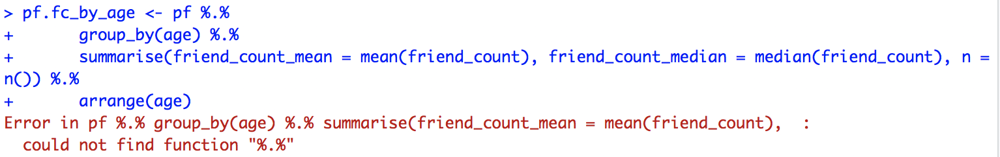
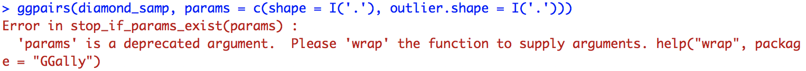

# R Console Issue

## Table of Contents

- [ERROR](https://github.com/jeongwhanchoi/Data-Analysis-with-R/blob/master/r_issue.md#error)
  - [LOCALE ERROR](https://github.com/jeongwhanchoi/Data-Analysis-with-R/blob/master/r_issue.md#locale-error)
  - [Pipe Operator Error in dplyr](https://github.com/jeongwhanchoi/Data-Analysis-with-R/blob/master/r_issue.md#pipe-operator-error-in-dplyr)
  - [The Deprecated Argument Error in GGally](https://github.com/jeongwhanchoi/Data-Analysis-with-R/blob/master/r_issue.md#the-deprecated-argument-error-in-ggally)
- [WARNING](https://github.com/jeongwhanchoi/Data-Analysis-with-R/blob/master/r_issue.md#warning)
  - [Warning message: package 'ggplot'](https://github.com/jeongwhanchoi/Data-Analysis-with-R/blob/master/r_issue.md#warning-message-package-ggplot)
  - [Syntax warning in 'geom_line'](https://github.com/jeongwhanchoi/Data-Analysis-with-R/blob/master/r_issue.md#Syntax-warning-in-geom_line)

---

## ERROR

### LOCALE ERROR

The errors on **Mac Sierra** are:

```
During startup - Warning messages:
1: Setting LC_CTYPE failed, using "C"
2: Setting LC_COLLATE failed, using "C"
3: Setting LC_TIME failed, using "C"
4: Setting LC_MESSAGES failed, using "C"
5: Setting LC_PAPER failed, using "C"
```

**Solve:**

1. Open Terminal

2. Write or paste in:

   `defaults write org.R-project.R force.LANG en_US.UTF-8`

3. Close Terminal

4. Start R

Reference: [StackOverflow](https://stackoverflow.com/questions/9689104/installing-r-on-mac-warning-messages-setting-lc-ctype-failed-using-c)

**Check:**

```R
> Sys.getlocale()
[1] "en_US.UTF-8/en_US.UTF-8/en_US.UTF-8/C/en_US.UTF-8/en_US.UTF-8"
> print("안녕")
[1] "안녕"
> print("hello")
[1] "hello"
```

> If you want to set your locale to `ko_KR.UTF-8`, write the code below:
>
> `Sys.setlocale('LC_ALL', 'ko_KR.UTF-8')`


### Pipe Operator Error in dplyr



```
could not find function "%.%"
```

**Solve:**

Please note that in newer versions of dplyr (0.3.x+), the syntax `%.%` has been deprecated and replaced with `%>%`.


### The Deprecated Argument Error in GGally



```
Error in stop_if_params_exist(params) : 
  'params' is a deprecated argument.  Please 'wrap' the function to supply arguments. help("wrap", package = "GGally")
```

**Solve**:

- Change the `params` argument to the `shape` like below.

```r
ggpairs(diamond_samp, shape = c(shape = I('.'), outlier.shape = I('.')))
```

**Note:**

The `params` argument to the `ggpairs` function are there to change the  `shape` of the plotted points in the plot matrix,  to make them easier to see.


## WARNING

### Warning message: package 'ggplot'

```
library(ggplot2)
Warning message:
package ‘ggplot2’ was built under R version 3.4.4 
```

**Solve:**

My current version of R is older than current version on [CRAN](https://cran.r-project.org/bin/macosx/). R has been updated 3.5.1 on 2nd July 2018, so you should update it when you have a chance.

1. Run the R Console
2. Check for R updates
3. Visit [CRAN](https://cran.r-project.org/bin/macosx/)


4. Re-install the [R-3.5.1.pkg](https://cran.r-project.org/bin/macosx/R-3.5.1.pkg)


5. Check your version of R is up to date


**Note:**

This warning can NOT be solved by updating RStudio like the screenshots below.


This update DOES NOT UPDATE your version of R, so you should update R via [**HERE**](https://stat.ethz.ch/pipermail/r-help/2018-March/451633.html).


### Syntax warning in geom_line

```r
ggplot(aes(x = age, y = friend_count), data = pf) + xlim(13, 90) + geom_point(alpha = 0.05, position = position_jitter(h=0), color = 'orange')+ coord_trans(y = 'sqrt') + geom_line(stat = 'summary', fun.y = mean) + geom_line(stat = 'summary', fun.y = quantile, probs = .1, linetype = 2 , color = 'blue')
```

```
Warning: Ignoring unknown parameters: probs
```

**Solve:**

- Put the `probs = .1` parameter in the `fun.args` argument like below
  - `fun.args = list(probs = .1)`

```r
ggplot(aes(x = age, y = friend_count), data = pf) + xlim(13, 90) + geom_point(alpha = 0.05, position = position_jitter(h=0), color = 'orange')+ coord_trans(y = 'sqrt') + geom_line(stat = 'summary', fun.y = mean) + geom_line(stat = 'summary', fun.y = quantile, fun.args = list(probs = .1), linetype = 2 , color = 'blue')
```

**Note**: ggplot 2.0.0 changes the syntax for parameter arguments to functions when using `stat = 'summary'`. To denote parameters that are being set on the function specified by `fun.y`, use the `fun.args`argument, e.g.:

```r
ggplot( ... ) +
  geom_line(stat = 'summary', fun.y = quantile,
            fun.args = list(probs = .9), ... )
```