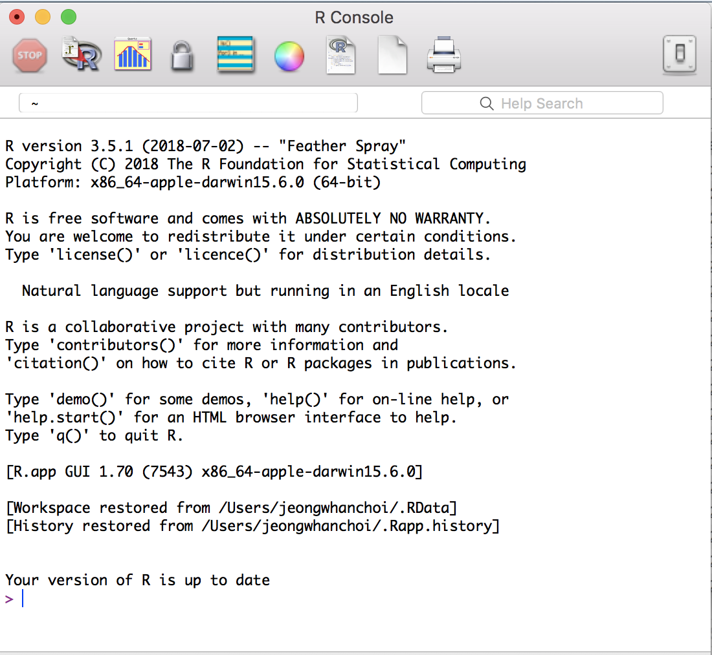

# R Console Issue

[TOC]
## ERROR

### LOCALE ERROR

The errors on **Mac Sierra** are:

```
During startup - Warning messages:
1: Setting LC_CTYPE failed, using "C"
2: Setting LC_COLLATE failed, using "C"
3: Setting LC_TIME failed, using "C"
4: Setting LC_MESSAGES failed, using "C"
5: Setting LC_PAPER failed, using "C"
```

**Solve:**

1. Open Terminal

2. Write or paste in:

   `defaults write org.R-project.R force.LANG en_US.UTF-8`

3. Close Terminal

4. Start R

Reference: [StackOverflow](https://stackoverflow.com/questions/9689104/installing-r-on-mac-warning-messages-setting-lc-ctype-failed-using-c)

**Check:**

```R
> Sys.getlocale()
[1] "en_US.UTF-8/en_US.UTF-8/en_US.UTF-8/C/en_US.UTF-8/en_US.UTF-8"
> print("안녕")
[1] "안녕"
> print("hello")
[1] "hello"
```

> If you want to set your locale to `ko_KR.UTF-8`, write the code below:
>
> `Sys.setlocale('LC_ALL', 'ko_KR.UTF-8')`

## WARNING

### Warning message: package 'ggplot'

```
library(ggplot2)
Warning message:
package ‘ggplot2’ was built under R version 3.4.4 
```

**Solve:**

My current version of R is older than current version on [CRAN](https://cran.r-project.org/bin/macosx/). R has been updated 3.5.1 on 2nd July 2018, so you should update it when you have a chance.

1. Run the R Console
2. Check for R updates
3. Visit [CRAN](https://cran.r-project.org/bin/macosx/)


4. Re-install the [R-3.5.1.pkg](https://cran.r-project.org/bin/macosx/R-3.5.1.pkg)


5. Check your version of R is up to date



**Note:**

This warning can NOT be solved by updating RStudio like the screenshots below.


This update DOES NOT UPDATE your version of R, so you should update R via [**HERE**](https://stat.ethz.ch/pipermail/r-help/2018-March/451633.html).